# Entity Relationship Diagram (ERD)

## Database Schema Visualization

This document provides a text-based ERD and Mermaid diagram for the CompTIA Network+ Learning Platform database schema.

## Mermaid ERD Diagram

```mermaid
erDiagram
    %% Core User Tables
    users ||--o| user_profiles : has
    users ||--o| user_settings : has
    users ||--o| learning_streaks : has
    users ||--o{ user_progress : tracks
    users ||--o{ learning_sessions : participates
    users ||--o{ bookmarks : creates
    users ||--o{ assessment_attempts : takes
    users ||--o{ user_achievements : earns
    users ||--o{ study_goals : sets
    users ||--o{ user_activity_logs : generates
    users ||--o{ learning_components : authors
    users ||--o{ assessments : creates
    users ||--o{ question_bank : creates

    %% Learning Content
    learning_components ||--o{ user_progress : "tracked by"
    learning_components ||--o{ learning_sessions : "used in"
    learning_components ||--o{ bookmarks : "bookmarked in"
    learning_components ||--o{ component_analytics : "analyzed in"

    %% Assessments
    assessments ||--o{ assessment_attempts : "attempted through"
    question_bank ||--o{ assessment_answers : "answered in"
    assessment_attempts ||--o{ assessment_answers : contains

    %% Achievements
    achievements ||--o{ user_achievements : "earned as"

    %% Table Definitions
    users {
        uuid id PK
        varchar email UK
        varchar username UK
        text password_hash
        varchar role
        boolean email_verified
        varchar account_status
        timestamptz created_at
        timestamptz updated_at
        timestamptz deleted_at
    }

    user_profiles {
        uuid id PK
        uuid user_id FK
        varchar first_name
        varchar last_name
        varchar display_name
        text bio
        text avatar_url
        varchar timezone
        varchar locale
        text_array certifications
        timestamptz created_at
        timestamptz updated_at
    }

    user_settings {
        uuid id PK
        uuid user_id FK
        varchar theme
        boolean notifications_enabled
        time reminder_time
        integer_array reminder_days
        varchar font_size
        integer daily_goal_minutes
        jsonb privacy_settings
        timestamptz created_at
        timestamptz updated_at
    }

    learning_components {
        uuid id PK
        varchar component_type
        varchar domain
        varchar subdomain
        varchar title
        varchar slug UK
        text description
        jsonb content
        varchar difficulty_level
        integer estimated_duration_minutes
        uuid_array prerequisites
        text_array objectives
        text_array comptia_objectives
        boolean is_published
        uuid created_by FK
        timestamptz created_at
        timestamptz updated_at
    }

    user_progress {
        uuid id PK
        uuid user_id FK
        uuid component_id FK
        varchar status
        integer progress_percentage
        integer time_spent_minutes
        jsonb last_position
        decimal best_score
        decimal latest_score
        timestamptz completion_date
        timestamptz created_at
        timestamptz updated_at
    }

    learning_sessions {
        uuid id PK
        uuid user_id FK
        uuid component_id FK
        timestamptz session_start
        timestamptz session_end
        integer duration_minutes
        integer interaction_count
        boolean completion_achieved
        varchar device_type
        jsonb session_data
        timestamptz created_at
    }

    bookmarks {
        uuid id PK
        uuid user_id FK
        uuid component_id FK
        jsonb position
        text note
        timestamptz created_at
        timestamptz updated_at
    }

    question_bank {
        uuid id PK
        varchar question_type
        varchar domain
        varchar subdomain
        varchar difficulty_level
        text question_text
        jsonb question_data
        jsonb correct_answer
        text explanation
        text_array hints
        integer points
        text_array comptia_objectives
        integer usage_count
        boolean is_published
        uuid created_by FK
        timestamptz created_at
        timestamptz updated_at
    }

    assessments {
        uuid id PK
        varchar assessment_type
        varchar title
        varchar slug UK
        text description
        varchar domain
        varchar difficulty_level
        integer time_limit_minutes
        integer passing_score
        uuid_array question_ids
        boolean randomize_questions
        boolean is_published
        uuid created_by FK
        timestamptz created_at
        timestamptz updated_at
    }

    assessment_attempts {
        uuid id PK
        uuid user_id FK
        uuid assessment_id FK
        integer attempt_number
        varchar status
        timestamptz started_at
        timestamptz completed_at
        integer time_spent_minutes
        decimal score
        decimal percentage
        boolean passed
        uuid_array question_order
        timestamptz created_at
        timestamptz updated_at
    }

    assessment_answers {
        uuid id PK
        uuid attempt_id FK
        uuid question_id FK
        jsonb user_answer
        boolean is_correct
        decimal points_earned
        integer time_spent_seconds
        timestamptz created_at
        timestamptz updated_at
    }

    achievements {
        uuid id PK
        varchar achievement_type
        varchar code UK
        varchar name
        text description
        jsonb criteria
        integer points
        varchar rarity
        boolean is_active
        timestamptz created_at
        timestamptz updated_at
    }

    user_achievements {
        uuid id PK
        uuid user_id FK
        uuid achievement_id FK
        timestamptz earned_at
        jsonb progress_data
    }

    learning_streaks {
        uuid id PK
        uuid user_id FK
        integer current_streak
        integer longest_streak
        date last_activity_date
        date streak_start_date
        integer total_active_days
        jsonb streak_history
        timestamptz created_at
        timestamptz updated_at
    }

    study_goals {
        uuid id PK
        uuid user_id FK
        varchar goal_type
        varchar title
        integer target_value
        integer current_value
        varchar metric
        date start_date
        date target_date
        date completed_date
        varchar status
        timestamptz created_at
        timestamptz updated_at
    }

    user_activity_logs {
        uuid id PK
        uuid user_id FK
        varchar activity_type
        text activity_description
        varchar resource_type
        uuid resource_id
        jsonb metadata
        inet ip_address
        text user_agent
        timestamptz created_at
    }

    component_analytics {
        uuid id PK
        uuid component_id FK
        date date
        integer views
        integer unique_users
        integer completions
        decimal average_time_minutes
        decimal average_score
        timestamptz created_at
        timestamptz updated_at
    }

    performance_metrics {
        uuid id PK
        varchar metric_type
        varchar metric_name
        decimal metric_value
        varchar unit
        jsonb tags
        timestamptz timestamp
        timestamptz created_at
    }
```



## Table Relationships Summary

### One-to-One Relationships

| Parent Table | Child Table | Relationship | Notes |
|-------------|-------------|--------------|-------|
| users | user_profiles | 1:1 | Each user has one profile |
| users | user_settings | 1:1 | Each user has one settings record |
| users | learning_streaks | 1:1 | Each user has one streak record |

### One-to-Many Relationships

| Parent Table | Child Table | Relationship | Cascade Rule |
|-------------|-------------|--------------|--------------|
| users | user_progress | 1:N | CASCADE on delete |
| users | learning_sessions | 1:N | CASCADE on delete |
| users | bookmarks | 1:N | CASCADE on delete |
| users | assessment_attempts | 1:N | CASCADE on delete |
| users | user_achievements | 1:N | CASCADE on delete |
| users | study_goals | 1:N | CASCADE on delete |
| users | user_activity_logs | 1:N | SET NULL on delete |
| learning_components | user_progress | 1:N | CASCADE on delete |
| learning_components | learning_sessions | 1:N | CASCADE on delete |
| learning_components | bookmarks | 1:N | CASCADE on delete |
| learning_components | component_analytics | 1:N | CASCADE on delete |
| assessments | assessment_attempts | 1:N | CASCADE on delete |
| assessment_attempts | assessment_answers | 1:N | CASCADE on delete |
| question_bank | assessment_answers | 1:N | CASCADE on delete |
| achievements | user_achievements | 1:N | CASCADE on delete |

### Many-to-Many Relationships (through junction tables)

| Table 1 | Junction | Table 2 | Notes |
|---------|----------|---------|-------|
| users | user_achievements | achievements | Users earn achievements |
| users | user_progress | learning_components | Users progress through components |
| assessments | (array) | question_bank | Assessments contain questions via array |

## Data Flow Diagrams

### User Learning Flow

```
User Login
    ↓
User Settings & Profile
    ↓
Browse Learning Components
    ↓
Select Component
    ↓
Create Learning Session
    ↓
Track Progress (user_progress)
    ↓
Complete Component
    ↓
Update Streak (learning_streaks)
    ↓
Check Achievements (user_achievements)
    ↓
Log Activity (user_activity_logs)
```

### Assessment Flow

```
User Selects Assessment
    ↓
Create Assessment Attempt
    ↓
Load Questions (question_bank)
    ↓
Present Questions (randomized)
    ↓
User Answers Questions
    ↓
Store Answers (assessment_answers)
    ↓
Calculate Score
    ↓
Update Attempt Record
    ↓
Update User Progress
    ↓
Check Achievements
```

### Analytics Flow

```
User Activity
    ↓
Learning Sessions
    ↓
Daily Aggregation
    ↓
Component Analytics
    ↓
Materialized Views
    ↓
Dashboard Queries
```

## Key Design Decisions

### 1. UUID Primary Keys

**Rationale:**
- Distributed system compatibility
- No sequential ID exposure
- Merge-friendly across databases
- URL-safe identifiers

**Drawback:**
- Slightly larger storage (16 bytes vs 4/8 bytes)
- Less human-readable

**Mitigation:**
- Proper indexing strategy
- Use slugs for user-facing URLs

### 2. JSONB for Flexible Data

**Use Cases:**
- `learning_components.content` - Dynamic content structure
- `question_bank.question_data` - Question-type-specific data
- `user_settings.privacy_settings` - Flexible settings
- `achievements.criteria` - Dynamic achievement rules

**Benefits:**
- Schema flexibility
- Efficient storage and querying
- Native PostgreSQL indexing support

**Considerations:**
- Validate JSON structure in application
- Use specific fields when frequently queried

### 3. Soft Deletes

**Tables with Soft Delete:**
- users
- learning_components
- assessments
- question_bank

**Implementation:**
- `deleted_at` timestamp column
- Indexes exclude deleted records
- Queries filter `WHERE deleted_at IS NULL`

**Benefits:**
- Data recovery capability
- Audit trail maintenance
- Referential integrity preservation

### 4. Array Columns

**Use Cases:**
- `learning_components.prerequisites` - Component dependencies
- `learning_components.objectives` - Learning objectives
- `learning_components.comptia_objectives` - Exam mapping
- `assessments.question_ids` - Question selection
- `user_settings.reminder_days` - Day selections

**Benefits:**
- Denormalized for performance
- Simple querying with array operators
- No junction table overhead

**Considerations:**
- Limited to PostgreSQL
- Array size should be reasonable

### 5. Automatic Timestamps

**Implementation:**
- Trigger function `update_updated_at_column()`
- Applied to all tables with `updated_at`

**Benefits:**
- Automatic audit trail
- Consistent behavior
- No application-level logic needed

### 6. Enum-like Check Constraints

**Examples:**
- `users.role` IN ('student', 'instructor', 'admin')
- `learning_components.component_type` IN (...)
- `user_progress.status` IN (...)

**Benefits:**
- Database-level validation
- Self-documenting
- Query optimization

**vs. Separate Enum Tables:**
- Simpler structure
- Better performance
- Trade-off: Less flexible for dynamic values

### 7. Composite Unique Constraints

**Examples:**
- `user_progress` (user_id, component_id)
- `bookmarks` (user_id, component_id)
- `user_achievements` (user_id, achievement_id)
- `component_analytics` (component_id, date)

**Purpose:**
- Prevent duplicate entries
- Natural business logic enforcement
- Query optimization

## Scalability Considerations

### Horizontal Scalability

**Read Replicas:**
- Analytics queries → Read replicas
- User dashboard → Read replicas
- Component browsing → Read replicas
- Write operations → Primary database

**Partitioning Strategy (Future):**

```sql
-- Partition learning_sessions by date
CREATE TABLE learning_sessions (...)
PARTITION BY RANGE (created_at);

-- Partition user_activity_logs by date
CREATE TABLE user_activity_logs (...)
PARTITION BY RANGE (created_at);
```

### Performance Optimization

**Materialized Views:**
- `mv_daily_user_activity` - Refresh nightly
- `mv_weekly_domain_progress` - Refresh weekly

**Indexes:**
- All foreign keys indexed
- Frequently filtered columns indexed
- Composite indexes for common query patterns

**Query Optimization:**
- Views for complex aggregations
- Functions for repeated logic
- Prepared statements in application

### Caching Strategy

**Application-level Cache:**
- Learning component catalog (5-10 min TTL)
- Achievement definitions (1 hour TTL)
- User settings (session duration)
- Question bank (10 min TTL)

**Database-level:**
- Connection pooling
- Shared buffer configuration
- Work memory optimization

## Migration Strategy

### Adding New Tables

1. Create new migration file: `00X_description.sql`
2. Include UP and DOWN sections
3. Add appropriate indexes
4. Update ERD documentation
5. Test on development database

### Modifying Existing Tables

1. Never drop columns (use soft deprecation)
2. Add new columns as nullable initially
3. Backfill data if needed
4. Add constraints after validation
5. Update application code before constraints

### Example Migration Template

```sql
-- UP MIGRATION
BEGIN;

-- Add new column
ALTER TABLE table_name
ADD COLUMN new_column VARCHAR(100);

-- Backfill data
UPDATE table_name
SET new_column = 'default_value'
WHERE new_column IS NULL;

-- Add constraint
ALTER TABLE table_name
ALTER COLUMN new_column SET NOT NULL;

COMMIT;

-- DOWN MIGRATION
-- ALTER TABLE table_name DROP COLUMN new_column;
```

## Best Practices

### Query Performance

1. **Use EXPLAIN ANALYZE** for slow queries
2. **Limit result sets** with pagination
3. **Avoid SELECT *** - specify columns
4. **Use EXISTS** instead of COUNT when checking existence
5. **Index foreign keys** automatically

### Data Integrity

1. **Use transactions** for multi-table operations
2. **Validate at database level** with constraints
3. **Use foreign keys** for referential integrity
4. **Implement audit logging** for sensitive operations
5. **Test migrations** on staging first

### Security

1. **Never store plain text passwords**
2. **Use parameterized queries** (prevent SQL injection)
3. **Implement row-level security** for multi-tenant data
4. **Audit sensitive operations** in activity logs
5. **Encrypt sensitive data** at rest and in transit

## Database Statistics

### Estimated Storage Requirements

**Per User (Average):**
- User records: ~2 KB
- Progress tracking: ~10 KB per component
- Session history: ~0.5 KB per session
- Activity logs: ~0.2 KB per log entry

**For 10,000 Users:**
- Core user data: ~20 MB
- Learning progress: ~2 GB (200 components)
- Session history: ~50 MB (100 sessions/user)
- Activity logs: ~200 MB (100 logs/user)
- **Total: ~2.3 GB**

**For 100,000 Users:**
- Estimated: ~23 GB

### Query Performance Targets

| Query Type | Target Time | Notes |
|-----------|-------------|-------|
| User login | < 50ms | Indexed on email/username |
| Dashboard load | < 200ms | Uses views and caching |
| Component list | < 100ms | Indexed on domain/type |
| Progress update | < 50ms | Simple UPDATE |
| Assessment submit | < 500ms | Transaction with multiple INSERTs |
| Analytics query | < 2s | Uses materialized views |

## Conclusion

This database schema provides a robust, scalable foundation for the CompTIA Network+ Learning Platform. Key features include:

- Comprehensive user and content management
- Detailed progress tracking and analytics
- Flexible assessment system
- Gamification through achievements
- Performance optimization through indexing and views
- Data integrity through constraints and relationships
- Scalability through partitioning and caching strategies

For implementation details, refer to the schema.sql file and migration scripts.
