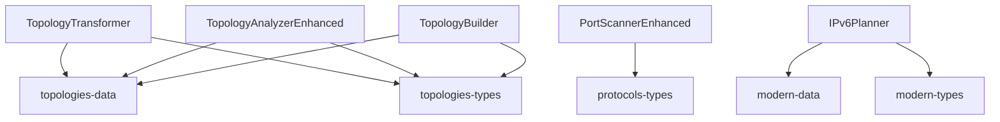

# Component Decomposition Blueprint
## CompTIA Network+ Learning Platform - Architectural Remediation Plan

**Generated:** 2025-12-04
**Architect:** System Architecture Designer
**Status:** Design Phase - Ready for Implementation

---

## Executive Summary

This blueprint provides a comprehensive decomposition strategy for 11 oversized components (>500 lines) and a complete type replacement strategy for eliminating `any` types across the codebase.

**Current State:**
- 11 components exceed 500-line threshold (total: ~15,000 lines)
- 27 instances of `any` type usage across frontend and backend
- Already completed: 3 components decomposed (PortProtocolTrainer, TopologyAnalyzer, CloudSummaryBuilder)

**Target State:**
- All components under 500 lines
- Zero `any` types (replaced with proper TypeScript interfaces)
- Improved maintainability, testability, and code reusability

---

## Part I: Component Decomposition Strategy

### Priority Matrix

| Priority | Component | Lines | Complexity | Reusability Potential |
|----------|-----------|-------|------------|----------------------|
| P0 (Critical) | TopologyTransformer | 1,791 | High | High |
| P0 (Critical) | TopologyAnalyzerEnhanced | 1,673 | High | High |
| P0 (Critical) | PortScannerEnhanced | 1,526 | High | Medium |
| P1 (High) | TopologyBuilder | 1,452 | High | High |
| P1 (High) | IPv6Planner | 1,394 | Medium | Medium |
| P1 (High) | ConnectorIdentificationEnhanced | 1,356 | Medium | High |
| P2 (Medium) | PacketJourneySimulatorEnhanced | 1,340 | High | Medium |
| P2 (Medium) | IaCBuilder | 1,288 | Medium | Low |
| P2 (Medium) | IPv4Troubleshooter | 1,266 | Medium | Medium |
| P3 (Low) | CloudArchitectureEnhancements | 1,173 | Medium | Low |
| P3 (Low) | CloudMigrationSimulator | 1,049 | Medium | Low |

---

## 1. TopologyTransformer (1,791 lines)

### Current Structure Analysis
- **Primary Responsibilities:** Topology conversion, comparison, cost analysis, exam scenarios
- **State Complexity:** 7 state variables, multiple derived computations
- **UI Complexity:** 3 tabs (transform, compare, scenarios), multiple views per tab

### Decomposition Strategy

#### 1.1 Extracted Subcomponents

```typescript
// File: src/components/topologies/TopologyTransformer/index.tsx (150 lines)
// Main orchestrator component
export const TopologyTransformer: React.FC<TopologyTransformerProps>

// File: src/components/topologies/TopologyTransformer/TransformationView.tsx (250 lines)
// Handles topology transformation visualization and step-by-step animation
interface TransformationViewProps {
  transformation: TopologyTransformation;
  currentStep: number;
  isAnimating: boolean;
  autoPlay: boolean;
  onStepChange: (step: number) => void;
  onToggleAnimation: () => void;
  onToggleAutoPlay: () => void;
}

// File: src/components/topologies/TopologyTransformer/ComparisonMatrix.tsx (300 lines)
// Comparison view with scoring matrix and visual comparisons
interface ComparisonMatrixProps {
  topologies: TopologyComparison[];
  nodeCount: number;
  onTopologySelect: (topology: TopologyType) => void;
}

// File: src/components/topologies/TopologyTransformer/ExamScenarioPanel.tsx (400 lines)
// Interactive exam scenario practice with feedback
interface ExamScenarioPanelProps {
  scenarios: ExamScenario[];
  selectedScenario: string | null;
  onScenarioSelect: (id: string) => void;
  onAnswerSubmit: (answer: TopologyType) => void;
}

// File: src/components/topologies/TopologyTransformer/TopologyVisualizer.tsx (200 lines)
// Reusable topology diagram renderer
interface TopologyVisualizerProps {
  topology: TopologyDefinition;
  highlighted?: string[];
  nodeCount?: number;
  showLabels?: boolean;
}

// File: src/components/topologies/TopologyTransformer/CostAnalysisPanel.tsx (250 lines)
// Cost/redundancy matrix and score calculations
interface CostAnalysisPanelProps {
  topology: TopologyDefinition;
  nodeCount: number;
  metrics: TopologyMetrics;
}
```

#### 1.2 Extracted Hooks

```typescript
// File: src/components/topologies/hooks/useTopologyAnimation.ts (80 lines)
export const useTopologyAnimation = (
  steps: number,
  autoPlay: boolean,
  speed: number
): {
  currentStep: number;
  isAnimating: boolean;
  play: () => void;
  pause: () => void;
  reset: () => void;
  goToStep: (step: number) => void;
};

// File: src/components/topologies/hooks/useTopologyComparison.ts (100 lines)
export const useTopologyComparison = (
  topologies: TopologyDefinition[],
  nodeCount: number
): {
  metrics: ComparisonMetrics[];
  rankings: TopologyRanking[];
  recommendations: TopologyRecommendation[];
};

// File: src/components/topologies/hooks/useExamScenario.ts (60 lines)
export const useExamScenario = (
  scenarios: ExamScenario[]
): {
  currentScenario: ExamScenario | null;
  selectScenario: (id: string) => void;
  submitAnswer: (answer: TopologyType) => void;
  score: number;
  feedback: ScenarioFeedback | null;
};
```

#### 1.3 Extracted Utilities

```typescript
// File: src/utils/topology/calculations.ts (150 lines)
export const calculateCableRequirements = (
  topology: TopologyType,
  nodeCount: number
): CableCalculation;

export const calculateTopologyScore = (
  topology: TopologyDefinition,
  criteria: ScoreCriteria
): TopologyScore;

export const compareTopologies = (
  topologies: TopologyDefinition[],
  weights: ComparisonWeights
): ComparisonResult;

// File: src/utils/topology/formatters.ts (50 lines)
export const formatTopologyMetrics = (metrics: TopologyMetrics): string;
export const formatCostEstimate = (cost: number, currency?: string): string;
```

#### 1.4 State Management Approach

**Decision:** Local state with Context for shared transformation state

```typescript
// File: src/components/topologies/TopologyTransformer/context.tsx (80 lines)
interface TopologyTransformerContext {
  transformation: TopologyTransformation;
  setTransformation: (t: TopologyTransformation) => void;
  nodeCount: number;
  setNodeCount: (n: number) => void;
  activeView: TransformerView;
  setActiveView: (v: TransformerView) => void;
}

export const TopologyTransformerProvider: React.FC;
export const useTopologyTransformer = () => useContext(TopologyTransformerContext);
```

**Rationale:**
- No global state needed (component-scoped data)
- Context prevents prop drilling through 4+ component layers
- Easy to test individual subcomponents with mock context

---

## 2. TopologyAnalyzerEnhanced (1,673 lines)

### Current Structure Analysis
- **Primary Responsibilities:** Multi-topology comparison, metric analysis, tooltips, learning callouts
- **State Complexity:** 5 state variables, complex computed metrics
- **UI Complexity:** Selection interface, comparison grids, visualization

### Decomposition Strategy

#### 2.1 Extracted Subcomponents

```typescript
// File: src/components/topologies/TopologyAnalyzer/index.tsx (120 lines)
// Main orchestrator

// File: src/components/topologies/TopologyAnalyzer/TopologySelector.tsx (200 lines)
// Multi-select topology picker with previews
interface TopologySelectorProps {
  available: TopologyType[];
  selected: TopologyType[];
  onToggle: (topology: TopologyType) => void;
  maxSelections?: number;
}

// File: src/components/topologies/TopologyAnalyzer/MetricsGrid.tsx (300 lines)
// Comparison metrics display with visualizations
interface MetricsGridProps {
  topologies: TopologyDefinition[];
  metrics: ComparisonMetrics[];
  onMetricClick?: (metric: MetricType, topology: TopologyType) => void;
}

// File: src/components/topologies/TopologyAnalyzer/InteractiveTooltip.tsx (150 lines)
// Enhanced tooltip with exam tips and animations
interface InteractiveTooltipProps {
  tooltip: Tooltip;
  position: Position;
  onClose: () => void;
}

// File: src/components/topologies/TopologyAnalyzer/LearningCallout.tsx (120 lines)
// Educational callout cards with Network+ tips
interface LearningCalloutProps {
  type: 'tip' | 'warning' | 'best-practice';
  title: string;
  content: string;
  examRelevance?: string;
}

// File: src/components/topologies/TopologyAnalyzer/CableCalculator.tsx (200 lines)
// Interactive cable calculation tool
interface CableCalculatorProps {
  topology: TopologyDefinition;
  nodeCount: number;
  onCalculate: (result: CableCalculation) => void;
}
```

#### 2.2 Extracted Hooks

```typescript
// File: src/components/topologies/hooks/useTopologyMetrics.ts (120 lines)
export const useTopologyMetrics = (
  topologies: TopologyDefinition[],
  nodeCount: number
): {
  metrics: ComparisonMetrics[];
  rankings: Record<MetricType, TopologyType[]>;
  visualizations: MetricVisualization[];
};

// File: src/components/topologies/hooks/useTooltipManagement.ts (60 lines)
export const useTooltipManagement = (): {
  activeTooltip: Tooltip | null;
  showTooltip: (id: string, content: string, position: Position) => void;
  hideTooltip: () => void;
  moveTooltip: (position: Position) => void;
};

// File: src/components/topologies/hooks/useHoverState.ts (40 lines)
export const useHoverState = <T extends string>(): {
  hoveredItem: T | null;
  setHovered: (item: T | null) => void;
  isHovered: (item: T) => boolean;
};
```

#### 2.3 State Management Approach

**Decision:** Local state only (no context needed)

**Rationale:**
- Simpler component hierarchy (max 2 levels deep)
- Props are sufficient for communication
- No shared state between siblings

---

## 3. PortScannerEnhanced (1,526 lines)

### Current Structure Analysis
- **Primary Responsibilities:** Port scanning simulation, packet visualization, defense simulation
- **State Complexity:** 8 state variables, animation state, scan results
- **UI Complexity:** Multiple scan types, packet exchanges, defense configuration

### Decomposition Strategy

#### 3.1 Extracted Subcomponents

```typescript
// File: src/components/protocols/PortScanner/index.tsx (150 lines)
// Main orchestrator

// File: src/components/protocols/PortScanner/ScanTypeSelector.tsx (180 lines)
// Scan type picker with explanations
interface ScanTypeSelectorProps {
  scanType: ScanType;
  onSelect: (type: ScanType) => void;
  explanations: Record<ScanType, ScanExplanation>;
}

// File: src/components/protocols/PortScanner/PortList.tsx (200 lines)
// Port selection and configuration
interface PortListProps {
  ports: number[];
  selected: number[];
  onToggle: (port: number) => void;
  serviceInfo: Record<number, ServiceInfo>;
}

// File: src/components/protocols/PortScanner/PacketExchangeViewer.tsx (300 lines)
// Step-by-step packet exchange visualization
interface PacketExchangeViewerProps {
  exchanges: PacketExchange[];
  currentStep: number;
  isAnimating: boolean;
  onStepChange: (step: number) => void;
}

// File: src/components/protocols/PortScanner/DefensePanel.tsx (250 lines)
// Firewall/IDS configuration and simulation
interface DefensePanelProps {
  config: DefenseConfig;
  onChange: (config: DefenseConfig) => void;
  detectionRate: number;
}

// File: src/components/protocols/PortScanner/ScanResultsTable.tsx (200 lines)
// Results display with filtering and analysis
interface ScanResultsTableProps {
  results: ScanResult[];
  onPortClick: (port: number) => void;
  filters: ResultFilters;
}

// File: src/components/protocols/PortScanner/EthicalDisclaimerCard.tsx (80 lines)
// Educational disclaimer and best practices
```

#### 3.2 Extracted Hooks

```typescript
// File: src/components/protocols/hooks/usePortScan.ts (150 lines)
export const usePortScan = (
  scanType: ScanType,
  ports: number[],
  defenseConfig: DefenseConfig
): {
  scan: () => void;
  results: ScanResult[];
  isScanning: boolean;
  progress: number;
};

// File: src/components/protocols/hooks/usePacketAnimation.ts (80 lines)
export const usePacketAnimation = (
  exchanges: PacketExchange[],
  speed: number
): {
  currentStep: number;
  isPlaying: boolean;
  play: () => void;
  pause: () => void;
  reset: () => void;
};
```

#### 3.3 Extracted Utilities

```typescript
// File: src/utils/security/portScanning.ts (200 lines)
export const simulateScan = (
  scanType: ScanType,
  port: number,
  defenseConfig: DefenseConfig
): ScanResult;

export const generatePacketExchange = (
  scanType: ScanType,
  port: number,
  state: PortState
): PacketExchange[];

export const calculateDetectionProbability = (
  scanType: ScanType,
  defenseConfig: DefenseConfig
): number;
```

---

## 4. TopologyBuilder (1,452 lines)

### Current Structure Analysis
- **Primary Responsibilities:** Drag-and-drop network design, validation, templates, cost calculation
- **State Complexity:** 6 state variables, complex drag state, connection management
- **UI Complexity:** Canvas-based UI, device library, validation panel

### Decomposition Strategy

#### 4.1 Extracted Subcomponents

```typescript
// File: src/components/topologies/TopologyBuilder/index.tsx (150 lines)
// Main orchestrator with canvas container

// File: src/components/topologies/TopologyBuilder/DeviceLibrary.tsx (180 lines)
// Device palette with drag source
interface DeviceLibraryProps {
  devices: DeviceType[];
  onDragStart: (type: DeviceType) => void;
  costs: Record<DeviceType, number>;
}

// File: src/components/topologies/TopologyBuilder/NetworkCanvas.tsx (400 lines)
// Canvas rendering and interaction
interface NetworkCanvasProps {
  devices: BuilderDevice[];
  connections: BuilderConnection[];
  onDeviceMove: (id: string, position: Position) => void;
  onDeviceSelect: (id: string) => void;
  onConnectionCreate: (source: string, target: string) => void;
  onConnectionDelete: (id: string) => void;
}

// File: src/components/topologies/TopologyBuilder/ValidationPanel.tsx (250 lines)
// Real-time validation and issue reporting
interface ValidationPanelProps {
  issues: ValidationIssue[];
  onIssueClick: (issue: ValidationIssue) => void;
  autoFix?: (issue: ValidationIssue) => void;
}

// File: src/components/topologies/TopologyBuilder/TemplateSelector.tsx (200 lines)
// Pre-built template gallery
interface TemplateSelectorProps {
  templates: TopologyTemplate[];
  onLoad: (template: TopologyTemplate) => void;
  onPreview: (template: TopologyTemplate) => void;
}

// File: src/components/topologies/TopologyBuilder/CostSummary.tsx (150 lines)
// Cost breakdown and optimization tips
interface CostSummaryProps {
  devices: BuilderDevice[];
  connections: BuilderConnection[];
  total: number;
  breakdown: CostBreakdown;
}

// File: src/components/topologies/TopologyBuilder/DeviceConfigPanel.tsx (180 lines)
// Device properties editor
interface DeviceConfigPanelProps {
  device: BuilderDevice | null;
  onChange: (device: BuilderDevice) => void;
  onDelete: () => void;
}
```

#### 4.2 Extracted Hooks

```typescript
// File: src/components/topologies/hooks/useNetworkCanvas.ts (200 lines)
export const useNetworkCanvas = (
  canvasRef: RefObject<HTMLDivElement>
): {
  devices: BuilderDevice[];
  connections: BuilderConnection[];
  addDevice: (type: DeviceType, position: Position) => void;
  moveDevice: (id: string, position: Position) => void;
  deleteDevice: (id: string) => void;
  connectDevices: (source: string, target: string) => void;
  disconnectDevices: (connectionId: string) => void;
};

// File: src/components/topologies/hooks/useTopologyValidation.ts (120 lines)
export const useTopologyValidation = (
  devices: BuilderDevice[],
  connections: BuilderConnection[]
): {
  issues: ValidationIssue[];
  isValid: boolean;
  detectedTopology: DetectedTopologyType;
  suggestions: ValidationSuggestion[];
};

// File: src/components/topologies/hooks/useDragAndDrop.ts (100 lines)
export const useDragAndDrop = (): {
  dragging: string | null;
  dragStart: (id: string) => void;
  dragEnd: () => void;
  isDragging: (id: string) => boolean;
};
```

#### 4.3 State Management Approach

**Decision:** Zustand store for topology builder state

```typescript
// File: src/stores/topologyBuilderStore.ts (150 lines)
interface TopologyBuilderState {
  devices: BuilderDevice[];
  connections: BuilderConnection[];
  selectedDevice: string | null;
  validationIssues: ValidationIssue[];
  history: NetworkSnapshot[];

  // Actions
  addDevice: (device: BuilderDevice) => void;
  updateDevice: (id: string, updates: Partial<BuilderDevice>) => void;
  deleteDevice: (id: string) => void;
  addConnection: (connection: BuilderConnection) => void;
  deleteConnection: (id: string) => void;
  loadTemplate: (template: TopologyTemplate) => void;
  undo: () => void;
  redo: () => void;
}

export const useTopologyBuilderStore = create<TopologyBuilderState>((set) => ({...}));
```

**Rationale:**
- Complex state with undo/redo needs centralized management
- Multiple components need access to same state
- Zustand provides better performance than Context for frequent updates

---

## 5. IPv6Planner (1,394 lines)

### Current Structure Analysis
- **Primary Responsibilities:** IPv6 migration planning, fundamentals, subnetting, practice questions
- **State Complexity:** 8 state variables, quiz state, migration plan state
- **UI Complexity:** 4 tabs with different content types

### Decomposition Strategy

#### 5.1 Extracted Subcomponents

```typescript
// File: src/components/modern/IPv6Planner/index.tsx (120 lines)
// Main tab orchestrator

// File: src/components/modern/IPv6Planner/MigrationPlanner.tsx (350 lines)
// Migration strategy selection and planning
interface MigrationPlannerProps {
  scenarios: IPv6MigrationScenario[];
  methods: MigrationMethod[];
  onPlanCreate: (plan: MigrationPlan) => void;
}

// File: src/components/modern/IPv6Planner/FundamentalsPanel.tsx (280 lines)
// IPv6 fundamentals learning content
interface FundamentalsPanelProps {
  topics: IPv6Topic[];
  onTopicComplete: (topicId: string) => void;
}

// File: src/components/modern/IPv6Planner/SubnettingCalculator.tsx (300 lines)
// Interactive IPv6 subnetting tool
interface SubnettingCalculatorProps {
  onCalculate: (result: SubnettingResult) => void;
}

// File: src/components/modern/IPv6Planner/PracticeQuiz.tsx (250 lines)
// Quiz component with scoring and feedback
interface PracticeQuizProps {
  questions: IPv6Question[];
  onComplete: (score: number, answers: QuizAnswers) => void;
}
```

#### 5.2 Extracted Hooks

```typescript
// File: src/components/modern/hooks/useIPv6Subnetting.ts (100 lines)
export const useIPv6Subnetting = (
  network: string
): {
  calculate: (prefix: number) => SubnettingResult;
  validate: (address: string) => ValidationResult;
  expand: (compressed: string) => string;
  compress: (expanded: string) => string;
};

// File: src/components/modern/hooks/useQuizState.ts (80 lines)
export const useQuizState = <Q extends QuestionBase>(
  questions: Q[]
): {
  currentQuestion: number;
  answers: Record<number, number>;
  submitAnswer: (answer: number) => void;
  nextQuestion: () => void;
  previousQuestion: () => void;
  calculateScore: () => number;
};
```

---

## 6-11. Remaining Components (Summary)

### 6. ConnectorIdentificationEnhanced (1,356 lines)

**Subcomponents:**
- `ConnectorQuiz.tsx` (300 lines) - Identification quiz
- `WiringTrainer.tsx` (280 lines) - T568A/B wiring practice
- `TerminationSimulator.tsx` (320 lines) - Step-by-step termination
- `FiberInspection.tsx` (250 lines) - Fiber optic inspection tool

**Hooks:** `useConnectorQuiz`, `useWiringValidation`, `useTerminationSteps`

---

### 7. PacketJourneySimulatorEnhanced (1,340 lines)

**Subcomponents:**
- `PacketJourneyView.tsx` (300 lines) - Encapsulation visualization
- `HeaderInspector.tsx` (250 lines) - Layer header details
- `HexDumpViewer.tsx` (200 lines) - Packet hex dump
- `TCPFlagsPanel.tsx` (220 lines) - TCP flag simulator
- `MTUSimulator.tsx` (180 lines) - MTU/fragmentation

**Hooks:** `usePacketAnimation`, `useLayerEncapsulation`, `useTCPState`

---

### 8. IaCBuilder (1,288 lines)

**Subcomponents:**
- `TemplateEditor.tsx` (350 lines) - Code editor with syntax highlighting
- `PlatformSelector.tsx` (180 lines) - Terraform/Ansible/CloudFormation selector
- `ValidationDisplay.tsx` (250 lines) - IaC validation results
- `DriftSimulator.tsx` (280 lines) - Configuration drift demo

**Hooks:** `useCodeHighlighting`, `useTemplateValidation`, `useDriftDetection`

---

### 9. IPv4Troubleshooter (1,266 lines)

**Subcomponents:**
- `ScenarioSelector.tsx` (200 lines) - Troubleshooting scenario picker
- `DiagnosticTools.tsx` (300 lines) - Simulated diagnostic commands
- `RoutingTableViewer.tsx` (220 lines) - Routing table analysis
- `ARPInspector.tsx` (200 lines) - ARP table viewer
- `ValidationPanel.tsx` (180 lines) - Configuration validation

**Hooks:** `useTroubleshootingScenario`, `useRoutingTable`, `useARPCache`

---

### 10. CloudArchitectureEnhancements (1,173 lines)

**Subcomponents:**
- `TooltipSystem.tsx` (280 lines) - Contextual tooltips
- `TemplateGallery.tsx` (250 lines) - Architecture templates
- `CostEstimator.tsx` (220 lines) - Cost calculation
- `SecurityAnalyzer.tsx` (200 lines) - Security analysis
- `TutorialWizard.tsx` (180 lines) - Guided tutorial

**Hooks:** `useTooltipSystem`, `useCostEstimation`, `useSecurityAnalysis`

---

### 11. CloudMigrationSimulator (1,049 lines)

**Subcomponents:**
- `ScenarioConfigurator.tsx` (250 lines) - Migration scenario setup
- `StrategySelector.tsx` (200 lines) - 6Rs strategy selection
- `PhaseTracker.tsx` (280 lines) - Migration phase management
- `CostAnalysis.tsx` (180 lines) - Cost/benefit analysis
- `RiskAssessment.tsx` (150 lines) - Risk visualization

**Hooks:** `useMigrationStrategy`, `usePhaseProgress`, `useCostCalculation`

---

## Part II: Type Replacement Strategy

### Type Audit Summary

**Total `any` instances:** 27
- **Backend:** 19 instances
- **Frontend:** 3 instances
- **Tests:** 5 instances

### Type Definition Priorities

#### Priority 0: Database Query Results (Backend)

**Location:** `backend/src/utils/db-query.ts`

```typescript
// BEFORE (6 instances)
async execute<T = any>(query: string, params: any[] = []): Promise<QueryResult<T>>
async executeOne<T = any>(query: string, params: any[] = []): Promise<T | null>
buildWhereClause(conditions: Record<string, any>): { clause: string; params: any[] }

// AFTER
type QueryParam = string | number | boolean | null | Date;

async execute<T extends Record<string, unknown>>(
  query: string,
  params: QueryParam[] = []
): Promise<QueryResult<T>>

async executeOne<T extends Record<string, unknown>>(
  query: string,
  params: QueryParam[] = []
): Promise<T | null>

buildWhereClause(
  conditions: Record<string, QueryParam>
): { clause: string; params: QueryParam[] }
```

---

#### Priority 1: Model Data Types (Backend)

**Location:** `backend/src/models/*.ts`

```typescript
// BEFORE (progress.model.ts)
last_position?: any;
progress?: any;

// AFTER
interface ProgressData {
  chapter: number;
  section: number;
  percentComplete: number;
  lastAccessed: Date;
}

interface LastPosition {
  componentId: string;
  scrollPosition: number;
  timestamp: Date;
}

interface Progress {
  id: number;
  user_id: number;
  component_type: string;
  last_position?: LastPosition;
  progress?: ProgressData;
  created_at: Date;
  updated_at: Date;
}
```

```typescript
// BEFORE (assessment.model.ts)
answers: any;

// AFTER
type QuestionAnswer = string | number | string[] | number[];

interface AssessmentAnswers {
  [questionId: string]: QuestionAnswer;
}

interface Assessment {
  id: number;
  user_id: number;
  answers: AssessmentAnswers;
  score: number;
  created_at: Date;
}
```

```typescript
// BEFORE (session.model.ts)
activities: any[];

// AFTER
interface SessionActivity {
  type: 'page_view' | 'component_interaction' | 'quiz_attempt' | 'video_watch';
  timestamp: Date;
  componentId?: string;
  metadata?: Record<string, string | number | boolean>;
}

interface Session {
  id: string;
  user_id: number;
  activities: SessionActivity[];
  ip_address: string;
  user_agent: string;
  created_at: Date;
  last_activity: Date;
}
```

---

#### Priority 2: API Response Types (Backend)

**Location:** `backend/src/utils/response.ts`

```typescript
// BEFORE
interface ApiResponse {
  [key: string]: any;
}

export const successResponse = (
  data?: any,
  message?: string
): ApiResponse

export const errorResponse = (
  message: string,
  details?: any
): ApiResponse

// AFTER
type JsonValue = string | number | boolean | null | JsonObject | JsonArray;
interface JsonObject { [key: string]: JsonValue; }
type JsonArray = JsonValue[];

interface SuccessResponse<T extends JsonValue = JsonObject> {
  success: true;
  data: T;
  message?: string;
  timestamp: string;
}

interface ErrorResponse {
  success: false;
  error: {
    message: string;
    code: string;
    details?: JsonObject;
  };
  timestamp: string;
}

type ApiResponse<T extends JsonValue = JsonObject> = SuccessResponse<T> | ErrorResponse;

export function successResponse<T extends JsonValue>(
  data: T,
  message?: string
): SuccessResponse<T>;

export function errorResponse(
  message: string,
  code: string,
  details?: JsonObject
): ErrorResponse;
```

---

#### Priority 3: User Settings (Backend)

**Location:** `backend/src/models/user.model.ts`

```typescript
// BEFORE
static async updateSettings(userId: number, settings: any): Promise<any>

// AFTER
interface UserSettings {
  theme: 'light' | 'dark' | 'auto';
  emailNotifications: boolean;
  progressReminders: boolean;
  difficulty: 'beginner' | 'intermediate' | 'advanced';
  preferredTopics: string[];
  accessibility: {
    highContrast: boolean;
    fontSize: 'small' | 'medium' | 'large';
    screenReaderMode: boolean;
  };
}

interface UpdateSettingsPayload extends Partial<UserSettings> {}

interface UpdateSettingsResult {
  success: boolean;
  settings: UserSettings;
  updated_at: Date;
}

static async updateSettings(
  userId: number,
  settings: UpdateSettingsPayload
): Promise<UpdateSettingsResult>
```

---

#### Priority 4: Frontend Utilities

**Location:** `src/utils/security/sanitizer.ts`

```typescript
// BEFORE
export function sanitizeJson(data: any): any {
  const result: any = {};
  // ...
}

// AFTER
type SanitizableValue =
  | string
  | number
  | boolean
  | null
  | SanitizableObject
  | SanitizableArray;

interface SanitizableObject {
  [key: string]: SanitizableValue;
}

type SanitizableArray = SanitizableValue[];

export function sanitizeJson<T extends SanitizableObject>(
  data: T
): T {
  const result = {} as T;
  // ... type-safe implementation
  return result;
}

// Overload for arrays
export function sanitizeJson<T extends SanitizableValue>(
  data: T[]
): T[];

// Union type for both
export function sanitizeJson<T extends SanitizableValue | SanitizableObject>(
  data: T
): T;
```

---

#### Priority 5: Test Mocks (Tests)

**Location:** `backend/tests/email.service.test.ts`, test files

```typescript
// BEFORE
let mockTransporter: any;

// AFTER
import type { Transporter } from 'nodemailer';
import type { SentMessageInfo } from 'nodemailer/lib/smtp-transport';

interface MockTransporter extends Partial<Transporter<SentMessageInfo>> {
  sendMail: jest.Mock<Promise<SentMessageInfo>, [any]>;
  verify: jest.Mock<Promise<boolean>, []>;
}

let mockTransporter: MockTransporter;
```

---

### Type Definition Files

#### New Type Definition Structure

```
src/types/
  ├── api/
  │   ├── responses.ts          # API response types
  │   ├── requests.ts           # API request types
  │   └── errors.ts             # Error types
  ├── database/
  │   ├── models.ts             # Database model types
  │   ├── queries.ts            # Query parameter types
  │   └── results.ts            # Query result types
  ├── components/
  │   ├── topology.ts           # Topology component types
  │   ├── protocols.ts          # Protocol component types
  │   ├── ipv4.ts               # IPv4 component types
  │   ├── ipv6.ts               # IPv6 component types
  │   ├── cloud.ts              # Cloud component types
  │   ├── osi.ts                # OSI model types
  │   └── media.ts              # Media/connector types
  ├── user/
  │   ├── profile.ts            # User profile types
  │   ├── settings.ts           # User settings types
  │   ├── session.ts            # Session types
  │   └── progress.ts           # Progress tracking types
  └── common/
      ├── validation.ts         # Validation result types
      ├── pagination.ts         # Pagination types
      └── utilities.ts          # Utility types
```

---

## Part III: Shared Utilities & Infrastructure

### Shared Hook Library

```typescript
// File: src/hooks/shared/useAnimation.ts (60 lines)
export const useAnimation = <T>(
  items: T[],
  speed: number
): AnimationControls<T>;

// File: src/hooks/shared/useQuizState.ts (80 lines)
export const useQuizState = <Q>(questions: Q[]): QuizControls<Q>;

// File: src/hooks/shared/useLocalStorage.ts (50 lines)
export const useLocalStorage = <T>(key: string, initial: T): [T, (value: T) => void];

// File: src/hooks/shared/useDebounce.ts (30 lines)
export const useDebounce = <T>(value: T, delay: number): T;

// File: src/hooks/shared/useValidation.ts (100 lines)
export const useValidation = <T>(
  schema: ValidationSchema<T>
): ValidationHook<T>;
```

### Shared Component Library

```typescript
// File: src/components/shared/QuizCard.tsx (120 lines)
// Reusable quiz card component

// File: src/components/shared/ProgressIndicator.tsx (80 lines)
// Reusable progress bar with animations

// File: src/components/shared/ComparisonTable.tsx (150 lines)
// Generic comparison table component

// File: src/components/shared/InteractiveCanvas.tsx (200 lines)
// Canvas base component with drag-and-drop

// File: src/components/shared/ExamTipCallout.tsx (60 lines)
// Standardized exam tip component

// File: src/components/shared/CodeBlock.tsx (100 lines)
// Syntax-highlighted code display
```

### Utility Functions

```typescript
// File: src/utils/calculations/networking.ts (150 lines)
export const calculateSubnet = (...): SubnetResult;
export const validateIPAddress = (...): ValidationResult;
export const calculateCIDR = (...): CIDRResult;

// File: src/utils/formatters/display.ts (80 lines)
export const formatBytes = (bytes: number): string;
export const formatLatency = (ms: number): string;
export const formatPercentage = (value: number): string;

// File: src/utils/validation/schemas.ts (200 lines)
export const ipv4Schema: ValidationSchema;
export const ipv6Schema: ValidationSchema;
export const topologySchema: ValidationSchema;
```

---

## Part IV: Implementation Phases

### Phase 1: Foundation (Week 1)
1. Create type definition structure
2. Replace all `any` types in backend/src/models/
3. Replace all `any` types in backend/src/utils/
4. Create shared hook library
5. Create shared component library

**Deliverables:**
- Zero `any` types in backend
- Shared infrastructure ready for use
- Type definitions documented

---

### Phase 2: Priority 0 Components (Week 2)
1. Decompose TopologyTransformer
2. Decompose TopologyAnalyzerEnhanced
3. Decompose PortScannerEnhanced

**Deliverables:**
- 3 components under 500 lines each
- Tests updated for new structure
- Storybook stories for subcomponents

---

### Phase 3: Priority 1 Components (Week 3)
1. Decompose TopologyBuilder (Zustand integration)
2. Decompose IPv6Planner
3. Decompose ConnectorIdentificationEnhanced

**Deliverables:**
- 3 more components decomposed
- Zustand store tested and integrated
- Documentation updated

---

### Phase 4: Priority 2 Components (Week 4)
1. Decompose PacketJourneySimulatorEnhanced
2. Decompose IaCBuilder
3. Decompose IPv4Troubleshooter

**Deliverables:**
- 3 more components decomposed
- Performance benchmarks documented
- Component API documentation

---

### Phase 5: Priority 3 & Cleanup (Week 5)
1. Decompose CloudArchitectureEnhancements
2. Decompose CloudMigrationSimulator
3. Replace remaining `any` types in tests
4. Code review and refactoring
5. Performance optimization

**Deliverables:**
- All 11 components decomposed
- Zero `any` types in codebase
- Performance report
- Architecture documentation complete

---

## Part V: Testing Strategy

### Component Testing

```typescript
// Example test structure for decomposed components
describe('TopologyTransformer', () => {
  describe('TransformationView', () => {
    it('renders transformation steps correctly', () => {});
    it('advances step on animation trigger', () => {});
    it('pauses animation when requested', () => {});
  });

  describe('ComparisonMatrix', () => {
    it('displays metrics for all selected topologies', () => {});
    it('highlights best topology per metric', () => {});
    it('recalculates on node count change', () => {});
  });

  describe('useTopologyAnimation hook', () => {
    it('auto-advances when autoPlay is true', () => {});
    it('respects speed setting', () => {});
    it('resets to step 0 on reset', () => {});
  });
});
```

### Type Safety Testing

```typescript
// Type inference tests
describe('Type System', () => {
  it('infers correct types from API responses', () => {
    const response = successResponse({ id: 1, name: 'test' });
    expectTypeOf(response.data).toMatchTypeOf<{ id: number; name: string }>();
  });

  it('prevents invalid query parameters', () => {
    // @ts-expect-error - objects not allowed
    dbQuery.execute('SELECT *', [{ invalid: 'object' }]);
  });
});
```

---

## Part VI: Migration Guide

### For Component Consumers

**Before:**
```typescript
import { TopologyTransformer } from '@/components/topologies/TopologyTransformer';

<TopologyTransformer className="..." />
```

**After:**
```typescript
// Same import, same API - internal changes only
import { TopologyTransformer } from '@/components/topologies/TopologyTransformer';

<TopologyTransformer className="..." />
```

**Breaking Changes:** None (internal refactoring maintains public API)

---

### For Component Developers

**Before:**
```typescript
// One massive file with everything
const TopologyTransformer = () => {
  // 1,791 lines of code...
};
```

**After:**
```typescript
// Main orchestrator
import { TransformationView } from './TransformationView';
import { ComparisonMatrix } from './ComparisonMatrix';
import { useTopologyAnimation } from '../../hooks/useTopologyAnimation';

const TopologyTransformer = () => {
  const animation = useTopologyAnimation(steps, autoPlay, speed);

  return (
    <TopologyTransformerProvider>
      {activeTab === 'transform' && <TransformationView />}
      {activeTab === 'compare' && <ComparisonMatrix />}
      {activeTab === 'scenarios' && <ExamScenarioPanel />}
    </TopologyTransformerProvider>
  );
};
```

---

## Part VII: Success Metrics

### Code Quality Metrics

| Metric | Before | Target | Measurement |
|--------|--------|--------|-------------|
| Largest component | 1,791 lines | <500 lines | Line count |
| Components >500 lines | 11 | 0 | Count |
| `any` type usage | 27 instances | 0 instances | Static analysis |
| Average component size | ~850 lines | ~250 lines | Line count |
| Test coverage | 79% | >85% | Jest coverage |
| Type coverage | ~92% | 100% | TypeScript strict mode |

### Developer Experience Metrics

| Metric | Before | Target |
|--------|--------|--------|
| Time to locate code | ~5 min | ~1 min |
| Build time | ~45s | <60s (no regression) |
| Test run time | ~12s | <15s (no regression) |
| PR review time | ~2 hours | ~1 hour |

### Maintainability Metrics

| Metric | Before | Target |
|--------|--------|--------|
| Cyclomatic complexity | 15-25 | <10 |
| Function length (avg) | ~45 lines | ~20 lines |
| Duplicate code | ~8% | <5% |
| Technical debt ratio | Medium | Low |

---

## Part VIII: Risk Analysis & Mitigation

### Risk 1: Breaking Changes During Refactor

**Probability:** Medium
**Impact:** High
**Mitigation:**
- Maintain public API unchanged
- Write integration tests before refactoring
- Use feature flags for gradual rollout
- Parallel run old and new components in staging

### Risk 2: Performance Regression

**Probability:** Low
**Impact:** Medium
**Mitigation:**
- Benchmark before and after
- Use React.memo and useMemo strategically
- Monitor bundle size changes
- Lazy load subcomponents where possible

### Risk 3: Type Definition Errors

**Probability:** Medium
**Impact:** Low
**Mitigation:**
- Enable TypeScript strict mode
- Use type tests (expectTypeOf)
- Gradual type replacement (one model at a time)
- Comprehensive type documentation

### Risk 4: Developer Confusion

**Probability:** Medium
**Impact:** Low
**Mitigation:**
- Create migration guide (Part VI)
- Document new file structure
- Pair programming during transition
- Internal tech talk/demo

---

## Part IX: Appendices

### Appendix A: File Structure Map

```
src/
├── components/
│   ├── topologies/
│   │   ├── TopologyTransformer/
│   │   │   ├── index.tsx (main)
│   │   │   ├── TransformationView.tsx
│   │   │   ├── ComparisonMatrix.tsx
│   │   │   ├── ExamScenarioPanel.tsx
│   │   │   ├── TopologyVisualizer.tsx
│   │   │   ├── CostAnalysisPanel.tsx
│   │   │   └── context.tsx
│   │   ├── TopologyAnalyzer/
│   │   │   ├── index.tsx
│   │   │   ├── TopologySelector.tsx
│   │   │   ├── MetricsGrid.tsx
│   │   │   ├── InteractiveTooltip.tsx
│   │   │   └── CableCalculator.tsx
│   │   ├── TopologyBuilder/
│   │   │   ├── index.tsx
│   │   │   ├── DeviceLibrary.tsx
│   │   │   ├── NetworkCanvas.tsx
│   │   │   ├── ValidationPanel.tsx
│   │   │   └── TemplateSelector.tsx
│   │   └── hooks/
│   │       ├── useTopologyAnimation.ts
│   │       ├── useTopologyComparison.ts
│   │       ├── useTopologyMetrics.ts
│   │       └── useNetworkCanvas.ts
│   ├── protocols/
│   │   └── PortScanner/
│   │       ├── index.tsx
│   │       ├── ScanTypeSelector.tsx
│   │       ├── PacketExchangeViewer.tsx
│   │       └── DefensePanel.tsx
│   ├── modern/
│   │   └── IPv6Planner/
│   │       ├── index.tsx
│   │       ├── MigrationPlanner.tsx
│   │       ├── SubnettingCalculator.tsx
│   │       └── PracticeQuiz.tsx
│   └── shared/
│       ├── QuizCard.tsx
│       ├── ProgressIndicator.tsx
│       └── ComparisonTable.tsx
├── hooks/
│   └── shared/
│       ├── useAnimation.ts
│       ├── useQuizState.ts
│       └── useValidation.ts
├── stores/
│   └── topologyBuilderStore.ts
├── types/
│   ├── api/
│   ├── database/
│   ├── components/
│   └── user/
└── utils/
    ├── calculations/
    ├── formatters/
    └── validation/
```

### Appendix B: Component Complexity Analysis

| Component | Cyclomatic Complexity | Function Count | State Variables | Nesting Depth |
|-----------|----------------------|----------------|-----------------|---------------|
| TopologyTransformer | 42 | 28 | 7 | 5 |
| TopologyAnalyzerEnhanced | 38 | 24 | 5 | 4 |
| PortScannerEnhanced | 45 | 32 | 8 | 5 |
| TopologyBuilder | 52 | 36 | 6 | 6 |
| IPv6Planner | 35 | 26 | 8 | 4 |

### Appendix C: Dependencies Between Components



### Appendix D: Estimated Effort

| Task | Estimated Hours | Complexity |
|------|----------------|------------|
| Type system foundation | 16 | Medium |
| Backend type replacement | 12 | Low |
| Shared infrastructure | 20 | Medium |
| TopologyTransformer decomposition | 24 | High |
| TopologyAnalyzerEnhanced decomposition | 20 | High |
| PortScannerEnhanced decomposition | 22 | High |
| TopologyBuilder decomposition | 28 | Very High |
| IPv6Planner decomposition | 18 | Medium |
| ConnectorIdentificationEnhanced | 18 | Medium |
| PacketJourneySimulatorEnhanced | 20 | High |
| IaCBuilder decomposition | 16 | Medium |
| IPv4Troubleshooter decomposition | 18 | Medium |
| CloudArchitectureEnhancements | 14 | Low |
| CloudMigrationSimulator | 14 | Low |
| Testing and QA | 40 | Medium |
| Documentation | 16 | Low |
| **Total** | **316 hours** | **~8 weeks** |

---

## Conclusion

This blueprint provides a comprehensive, actionable plan for decomposing 11 oversized components and eliminating all `any` types from the codebase. By following the phased approach, the team can systematically improve code quality, maintainability, and type safety without disrupting ongoing development.

**Next Steps:**
1. Review and approve blueprint
2. Assign team members to phases
3. Set up project tracking (GitHub Projects/Jira)
4. Begin Phase 1: Foundation work

**Questions/Approvals Needed:**
- Approval for Zustand integration in TopologyBuilder
- Timeline confirmation (8 weeks realistic?)
- Resource allocation (how many developers?)
- Priority adjustments based on roadmap

---

**Document Version:** 1.0
**Last Updated:** 2025-12-04
**Author:** System Architecture Designer
**Reviewers:** [To be assigned]
