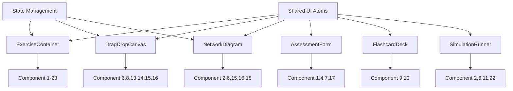

# Component Breakdown - Implementation Mapping

## Overview

This document maps the 23 interactive components from the specifications to implementation units, identifies reusable patterns, defines component dependencies, and establishes development phases.

---

## Shared Component Patterns

### Pattern 1: Interactive Exercise Base

**Description**: Common foundation for all exercise components
**Reuse Count**: 23 components

**Shared Features**:
- Progress indicator
- Timer (optional)
- Hint system (3 hints, 10% penalty each)
- Score calculation
- Reset/restart functionality
- Accessibility controls (keyboard nav, screen reader)

**Implementation**:
```tsx
// src/shared/ui/organisms/ExerciseContainer.tsx
interface ExerciseContainerProps {
  title: string
  description: string
  maxScore: number
  hintsAvailable?: number
  timeLimit?: number
  onComplete: (score: number) => void
  children: ReactNode
}

export function ExerciseContainer({
  title,
  description,
  maxScore,
  hintsAvailable = 3,
  timeLimit,
  onComplete,
  children
}: ExerciseContainerProps) {
  const [hintsUsed, setHintsUsed] = useState(0)
  const [timeElapsed, setTimeElapsed] = useState(0)

  return (
    <div className="exercise-container">
      <header>
        <h2>{title}</h2>
        <ExerciseControls
          hintsRemaining={hintsAvailable - hintsUsed}
          timeElapsed={timeElapsed}
          maxScore={maxScore}
        />
      </header>

      <main>{children}</main>

      <ExerciseFooter
        onReset={() => {/* reset logic */}}
        onSubmit={() => {/* submit logic */}}
      />
    </div>
  )
}
```

**Components Using This**: All 23 components

---

### Pattern 2: Drag-and-Drop Interface

**Description**: Standardized drag-and-drop implementation
**Reuse Count**: 6 components (6, 8, 13, 14, 15, 16)

**Shared Features**:
- Device/item library panel
- Canvas/target drop zones
- Connection visualization
- Snap-to-grid option
- Undo/redo stack
- Export/import capability

**Implementation**:
```tsx
// src/features/drag-drop-builder/DragDropCanvas.tsx
interface DragDropCanvasProps<T> {
  items: T[]
  gridSize?: number
  snapToGrid?: boolean
  onItemPlaced: (item: T, position: Position) => void
  renderItem: (item: T) => ReactNode
  renderTarget?: (position: Position) => ReactNode
}

export function DragDropCanvas<T extends DraggableItem>({
  items,
  gridSize = 50,
  snapToGrid = true,
  onItemPlaced,
  renderItem,
  renderTarget
}: DragDropCanvasProps<T>) {
  // DnD Kit implementation
  // Grid snapping logic
  // Collision detection
  // Undo/redo management
}
```

**Components Using This**:
- Component 6: Network Architecture Simulator
- Component 8: Cloud Architecture Designer
- Component 13: Connector Identification Lab (parts assembly)
- Component 14: Transceiver Matching Game
- Component 15: Topology Comparison Analyzer
- Component 16: Topology Transformation Tool

---

### Pattern 3: Network Diagram Visualizer

**Description**: React Flow-based network topology rendering
**Reuse Count**: 5 components (2, 6, 15, 16, 18)

**Shared Features**:
- Custom node types (router, switch, firewall, etc.)
- Animated edges (packet flow)
- Minimap for navigation
- Zoom controls (50%-400%)
- Node configuration panels
- Traffic simulation

**Implementation**:
```tsx
// src/features/network-diagram/NetworkDiagram.tsx
interface NetworkDiagramProps {
  nodes: NetworkNode[]
  edges: NetworkEdge[]
  onNodeClick?: (node: NetworkNode) => void
  onEdgeClick?: (edge: NetworkEdge) => void
  animateTraffic?: boolean
  editable?: boolean
}

const nodeTypes = {
  router: RouterNode,
  switch: SwitchNode,
  firewall: FirewallNode,
  loadBalancer: LoadBalancerNode,
  server: ServerNode,
  client: ClientNode
}

export function NetworkDiagram({
  nodes,
  edges,
  animateTraffic,
  editable
}: NetworkDiagramProps) {
  return (
    <ReactFlow
      nodes={nodes}
      edges={edges}
      nodeTypes={nodeTypes}
      edgeTypes={{ animated: AnimatedEdge }}
      fitView
    >
      <Background />
      <Controls />
      <MiniMap />
    </ReactFlow>
  )
}
```

**Components Using This**:
- Component 2: Packet Journey Simulator
- Component 6: Network Architecture Simulator
- Component 15: Topology Comparison Analyzer
- Component 16: Topology Transformation Tool
- Component 18: IPv4 Troubleshooting Scenarios

---

### Pattern 4: Form-Based Assessment

**Description**: Multi-section form with validation and scoring
**Reuse Count**: 4 components (1, 4, 7, 17)

**Shared Features**:
- Section-based navigation
- Real-time validation
- Progress indicator per section
- Auto-save (draft mode)
- Rubric-based scoring
- Detailed feedback

**Implementation**:
```tsx
// src/features/assessment-form/AssessmentForm.tsx
interface AssessmentSection {
  id: string
  title: string
  fields: FormField[]
  validation: ValidationSchema
  weight: number
}

interface AssessmentFormProps {
  sections: AssessmentSection[]
  onSubmit: (data: FormData, score: number) => void
  autoSave?: boolean
}

export function AssessmentForm({
  sections,
  onSubmit,
  autoSave = true
}: AssessmentFormProps) {
  const { register, handleSubmit, watch } = useForm()
  const [currentSection, setCurrentSection] = useState(0)

  // Auto-save logic
  useEffect(() => {
    if (autoSave) {
      const data = watch()
      localStorage.setItem('draft', JSON.stringify(data))
    }
  }, [watch()])

  // Validation and scoring
  const calculateScore = (data: FormData) => {
    return sections.reduce((total, section) => {
      const sectionScore = validateSection(section, data)
      return total + (sectionScore * section.weight)
    }, 0)
  }

  return (
    <form onSubmit={handleSubmit(onSubmit)}>
      <SectionNavigator
        sections={sections}
        current={currentSection}
        onChange={setCurrentSection}
      />

      <SectionContent
        section={sections[currentSection]}
        register={register}
      />

      <FormControls />
    </form>
  )
}
```

**Components Using This**:
- Component 1: Layer Explanation Builder
- Component 4: Appliance Comparison Matrix
- Component 7: Cloud Concept Summary Builder
- Component 17: Scenario-Based Subnet Designer

---

### Pattern 5: Flashcard System

**Description**: Spaced repetition flashcard interface
**Reuse Count**: 2 components (9, 10)

**Shared Features**:
- Card flip animation
- Progress tracking
- Spaced repetition algorithm
- Difficulty rating (easy/medium/hard)
- Deep-dive explanations
- Bookmark/favorite system

**Implementation**:
```tsx
// src/features/flashcard/FlashcardDeck.tsx
interface Flashcard {
  id: string
  front: ReactNode
  back: ReactNode
  category: string
  difficulty: 'easy' | 'medium' | 'hard'
  lastReviewed?: Date
  reviewCount: number
}

interface FlashcardDeckProps {
  cards: Flashcard[]
  onComplete: (mastered: string[]) => void
  spacedRepetition?: boolean
}

export function FlashcardDeck({
  cards,
  onComplete,
  spacedRepetition = true
}: FlashcardDeckProps) {
  const [currentCard, setCurrentCard] = useState(0)
  const [isFlipped, setIsFlipped] = useState(false)

  // Spaced repetition logic (SM-2 algorithm)
  const nextCard = () => {
    if (spacedRepetition) {
      return cards.sort((a, b) => {
        const aScore = calculateSM2Score(a)
        const bScore = calculateSM2Score(b)
        return bScore - aScore
      })[0]
    }
    return cards[currentCard + 1]
  }

  return (
    <motion.div
      className="flashcard"
      animate={{ rotateY: isFlipped ? 180 : 0 }}
      onClick={() => setIsFlipped(!isFlipped)}
    >
      <CardFront>{cards[currentCard].front}</CardFront>
      <CardBack>{cards[currentCard].back}</CardBack>
    </motion.div>
  )
}
```

**Components Using This**:
- Component 9: Port/Protocol Explanation Trainer
- Component 10: Traffic Type Demonstrator

---

### Pattern 6: Simulation Runner

**Description**: Interactive scenario simulation with step-through
**Reuse Count**: 4 components (2, 6, 11, 22)

**Shared Features**:
- Play/pause/step controls
- Playback speed adjustment
- Timeline scrubbing
- State inspection (click to view)
- Event log
- Export trace

**Implementation**:
```tsx
// src/features/simulator/SimulationRunner.tsx
interface SimulationStep {
  id: string
  timestamp: number
  description: string
  state: any
  visualization: ReactNode
}

interface SimulationRunnerProps {
  steps: SimulationStep[]
  autoPlay?: boolean
  speed?: number
  onStepComplete?: (step: SimulationStep) => void
}

export function SimulationRunner({
  steps,
  autoPlay = false,
  speed = 1
}: SimulationRunnerProps) {
  const [currentStep, setCurrentStep] = useState(0)
  const [isPlaying, setIsPlaying] = useState(autoPlay)

  useEffect(() => {
    if (isPlaying && currentStep < steps.length) {
      const timer = setTimeout(() => {
        setCurrentStep(prev => prev + 1)
      }, 1000 / speed)

      return () => clearTimeout(timer)
    }
  }, [isPlaying, currentStep, speed])

  return (
    <div className="simulation-runner">
      <SimulationViewport>
        {steps[currentStep].visualization}
      </SimulationViewport>

      <SimulationControls
        isPlaying={isPlaying}
        onPlay={() => setIsPlaying(true)}
        onPause={() => setIsPlaying(false)}
        onStep={() => setCurrentStep(prev => prev + 1)}
        speed={speed}
      />

      <Timeline
        steps={steps}
        current={currentStep}
        onChange={setCurrentStep}
      />
    </div>
  )
}
```

**Components Using This**:
- Component 2: Packet Journey Simulator
- Component 6: Network Architecture Simulator
- Component 11: Port Scanner Simulator
- Component 22: Integrated Scenario Simulator

---

## Component Dependencies

### Dependency Graph



### External Library Dependencies by Component

| Component | React Flow | Three.js | Recharts | Framer Motion | DnD Kit | React Hook Form |
|-----------|-----------|----------|----------|---------------|---------|-----------------|
| 1. Layer Explanation Builder | - | - | - | ✓ | - | ✓ |
| 2. Packet Journey Simulator | ✓ | - | - | ✓ | - | - |
| 3. Troubleshooting Scenarios | - | - | - | ✓ | - | ✓ |
| 4. Appliance Comparison | - | - | - | ✓ | - | ✓ |
| 5. Virtual vs Physical | ✓ | - | - | ✓ | - | - |
| 6. Network Architecture Sim | ✓ | - | - | ✓ | ✓ | - |
| 7. Cloud Concept Builder | - | - | - | ✓ | - | ✓ |
| 8. Cloud Architecture Designer | ✓ | - | - | ✓ | ✓ | - |
| 9. Port/Protocol Trainer | - | - | - | ✓ | - | - |
| 10. Traffic Type Demo | ✓ | - | - | ✓ | - | - |
| 11. Port Scanner Simulator | - | - | - | ✓ | - | - |
| 12. Media Selection Matrix | - | - | - | ✓ | - | ✓ |
| 13. Connector Identification | - | ✓ | - | ✓ | ✓ | - |
| 14. Transceiver Matching | - | - | - | ✓ | ✓ | - |
| 15. Topology Comparison | ✓ | - | - | ✓ | ✓ | - |
| 16. Topology Transformation | ✓ | - | - | ✓ | - | - |
| 17. Subnet Designer | - | - | - | ✓ | - | ✓ |
| 18. IPv4 Troubleshooting | ✓ | - | - | ✓ | - | - |
| 19. Modern Network Summarizer | - | - | - | ✓ | - | ✓ |
| 20. IPv6 Migration Planner | ✓ | - | - | ✓ | - | ✓ |
| 21. IaC Automation Builder | - | - | - | ✓ | ✓ | - |
| 22. Integrated Simulator | ✓ | - | - | ✓ | ✓ | ✓ |
| 23. Progress Dashboard | - | - | ✓ | ✓ | - | - |

---

## Development Phases

### Phase 1: Foundation (Weeks 1-2)

**Goal**: Establish architecture and shared patterns

**Deliverables**:
1. Project setup (Vite + React + TypeScript)
2. Shared UI components (atoms, molecules)
3. ExerciseContainer base component
4. Basic routing structure
5. State management setup (Zustand + React Query)
6. API client configuration
7. Testing infrastructure (Vitest + Testing Library)

**Team**: 2 developers

**Risk**: Low (standard setup)

---

### Phase 2: Core Patterns (Weeks 3-4)

**Goal**: Build reusable component patterns

**Deliverables**:
1. DragDropCanvas pattern (Component 6)
2. NetworkDiagram pattern (Component 2)
3. AssessmentForm pattern (Component 1)
4. FlashcardDeck pattern (Component 9)
5. SimulationRunner pattern (Component 11)
6. Unit tests for all patterns

**Team**: 3 developers (parallel development)

**Risk**: Medium (React Flow and Three.js learning curve)

---

### Phase 3: OSI Model Components (Weeks 5-7)

**Goal**: Complete Learning Objective 1.0

**Components**:
- [x] Component 1: Layer Explanation Builder (5 days)
- [x] Component 2: Packet Journey Simulator (7 days)
- [x] Component 3: Troubleshooting Scenarios (5 days)

**Dependencies**:
- AssessmentForm pattern (Component 1)
- NetworkDiagram + SimulationRunner (Component 2)
- AssessmentForm pattern (Component 3)

**Team**: 3 developers (1 per component)

**Risk**: Low (patterns already built)

---

### Phase 4: Appliances & Cloud (Weeks 8-10)

**Goal**: Complete Learning Objectives 1.1 and 1.2

**Components**:
- [x] Component 4: Appliance Comparison Matrix (3 days)
- [x] Component 5: Virtual vs Physical Decision Tree (4 days)
- [x] Component 6: Network Architecture Simulator (7 days)
- [x] Component 7: Cloud Concept Builder (3 days)
- [x] Component 8: Cloud Architecture Designer (7 days)

**Dependencies**:
- DragDropCanvas + NetworkDiagram (Component 6)
- DragDropCanvas + NetworkDiagram (Component 8)

**Team**: 3 developers

**Risk**: Low (reusing established patterns)

---

### Phase 5: Protocols & Media (Weeks 11-13)

**Goal**: Complete Learning Objectives 1.3 and 1.4

**Components**:
- [x] Component 9: Port/Protocol Trainer (5 days)
- [x] Component 10: Traffic Type Demonstrator (4 days)
- [x] Component 11: Port Scanner Simulator (5 days)
- [x] Component 12: Media Selection Matrix (3 days)
- [x] Component 13: Connector Identification Lab (10 days)
- [x] Component 14: Transceiver Matching Game (4 days)

**Dependencies**:
- Three.js integration (Component 13) - HIGHEST COMPLEXITY
- FlashcardDeck pattern (Components 9, 10)
- SimulationRunner pattern (Component 11)
- DragDropCanvas pattern (Component 14)

**Team**: 4 developers (Component 13 gets 2 devs)

**Risk**: High (3D rendering is new, requires modeling/optimization)

---

### Phase 6: Topologies & Addressing (Weeks 14-16)

**Goal**: Complete Learning Objectives 1.5 and 1.7

**Components**:
- [x] Component 15: Topology Comparison Analyzer (7 days)
- [x] Component 16: Topology Transformation Tool (7 days)
- [x] Component 17: Scenario-Based Subnet Designer (5 days)
- [x] Component 18: IPv4 Troubleshooting Scenarios (5 days)

**Dependencies**:
- NetworkDiagram + DragDropCanvas (Components 15, 16)
- AssessmentForm pattern (Component 17)
- NetworkDiagram pattern (Component 18)

**Team**: 3 developers

**Risk**: Medium (subnet calculations need extensive validation)

---

### Phase 7: Modern Networking (Weeks 17-19)

**Goal**: Complete Learning Objective 1.8

**Components**:
- [x] Component 19: Modern Network Summarizer (4 days)
- [x] Component 20: IPv6 Migration Planner (6 days)
- [x] Component 21: IaC Automation Builder (7 days)

**Dependencies**:
- AssessmentForm pattern (Components 19, 20)
- DragDropCanvas + code editor (Component 21)

**Team**: 3 developers

**Risk**: Low (established patterns)

---

### Phase 8: Integration & Assessment (Weeks 20-22)

**Goal**: Complete cross-component features

**Components**:
- [x] Component 22: Integrated Scenario Simulator (10 days)
- [x] Component 23: Progress Tracking Dashboard (7 days)
- [x] Backend integration (all components) (5 days)
- [x] Comprehensive testing (E2E scenarios) (5 days)

**Dependencies**:
- All previous components (Component 22 uses everything)
- Recharts integration (Component 23)
- Backend API complete

**Team**: 4 developers + 1 QA engineer

**Risk**: High (integration complexity, many dependencies)

---

### Phase 9: Polish & Launch (Weeks 23-24)

**Goal**: Production-ready platform

**Deliverables**:
1. Performance optimization (bundle size, lazy loading)
2. Accessibility audit and fixes (WCAG 2.1 AA)
3. Browser testing (Chrome, Firefox, Safari, Edge)
4. Mobile responsiveness
5. Analytics integration
6. Documentation (user guide, admin guide)
7. Deployment to production

**Team**: All developers + designer + QA

**Risk**: Low (refinement phase)

---

## Reusable Utilities

### Subnet Calculator

**Location**: `src/shared/lib/networking/subnet-calculator.ts`
**Used By**: Components 17, 18, 22

```typescript
export interface SubnetCalculation {
  networkAddress: string
  broadcastAddress: string
  firstUsableIP: string
  lastUsableIP: string
  usableHosts: number
  subnetMask: string
  cidr: number
  wildcardMask: string
}

export function calculateSubnet(
  ipAddress: string,
  cidr: number
): SubnetCalculation {
  // IP address parsing
  // Subnet mask calculation
  // Usable range determination
}

export function vlsmSubnetting(
  networkBlock: string,
  requirements: { name: string; hosts: number }[]
): SubnetCalculation[] {
  // VLSM algorithm implementation
}
```

### Protocol Database

**Location**: `src/shared/lib/networking/protocol-database.ts`
**Used By**: Components 2, 3, 6, 9, 10, 11, 22

```typescript
export interface ProtocolInfo {
  name: string
  port?: number
  layer: 1 | 2 | 3 | 4 | 5 | 6 | 7
  description: string
  secure: boolean
  commonUses: string[]
  relatedProtocols: string[]
}

export const protocols: Record<string, ProtocolInfo> = {
  HTTP: {
    name: 'Hypertext Transfer Protocol',
    port: 80,
    layer: 7,
    description: 'Web page retrieval protocol',
    secure: false,
    commonUses: ['Web browsing', 'API requests'],
    relatedProtocols: ['HTTPS', 'HTTP/2', 'HTTP/3']
  },
  // ... 50+ protocols
}

export function getProtocolsByLayer(layer: number): ProtocolInfo[] {
  return Object.values(protocols).filter(p => p.layer === layer)
}
```

### Scoring Engine

**Location**: `src/shared/lib/assessment/scoring-engine.ts`
**Used By**: All components

```typescript
export interface ScoringRubric {
  criteria: {
    name: string
    weight: number
    validator: (answer: any) => number
  }[]
  hintsAvailable: number
  hintPenalty: number
  timeBonus?: {
    threshold: number
    bonus: number
  }
}

export function calculateScore(
  answers: any,
  rubric: ScoringRubric,
  hintsUsed: number,
  timeElapsed: number
): {
  rawScore: number
  finalScore: number
  breakdown: Record<string, number>
  feedback: string[]
} {
  // Score calculation logic
  // Hint penalty application
  // Time bonus calculation
  // Detailed feedback generation
}
```

### Progress Tracker

**Location**: `src/shared/lib/progress/progress-tracker.ts`
**Used By**: All components, Component 23

```typescript
export interface ComponentProgress {
  componentId: string
  attempts: number
  bestScore: number
  timeSpent: number
  lastAttempt: Date
  completed: boolean
  masteryLevel: 'novice' | 'competent' | 'proficient' | 'expert'
}

export interface LearningObjectiveProgress {
  objectiveId: string
  components: ComponentProgress[]
  overallProgress: number
  estimatedTimeToComplete: number
}

export function calculateMasteryLevel(
  scores: number[],
  attempts: number
): 'novice' | 'competent' | 'proficient' | 'expert' {
  // Mastery algorithm
  // Consider consistency, improvement trend, attempts
}
```

---

## Component Complexity Matrix

| Component | UI Complexity | Logic Complexity | Data Complexity | Testing Effort | Total Effort (days) |
|-----------|--------------|------------------|-----------------|----------------|---------------------|
| 1 | High | Medium | Low | Medium | 5 |
| 2 | Very High | High | Medium | High | 7 |
| 3 | Medium | Medium | Medium | Medium | 5 |
| 4 | Medium | Low | Low | Low | 3 |
| 5 | Medium | Medium | Low | Low | 4 |
| 6 | Very High | Very High | High | High | 7 |
| 7 | Medium | Medium | Low | Medium | 3 |
| 8 | Very High | High | Medium | High | 7 |
| 9 | Medium | Medium | Medium | Medium | 5 |
| 10 | High | Medium | Medium | Medium | 4 |
| 11 | High | High | Medium | High | 5 |
| 12 | Medium | Low | Low | Low | 3 |
| 13 | Very High | High | Low | Very High | 10 |
| 14 | Medium | Medium | Low | Medium | 4 |
| 15 | High | High | Medium | High | 7 |
| 16 | High | Very High | Medium | High | 7 |
| 17 | Medium | Very High | Medium | High | 5 |
| 18 | High | High | Medium | High | 5 |
| 19 | Medium | Medium | Low | Medium | 4 |
| 20 | High | High | Medium | High | 6 |
| 21 | High | High | Medium | High | 7 |
| 22 | Very High | Very High | Very High | Very High | 10 |
| 23 | High | High | High | Medium | 7 |

**Total Effort**: 130 developer-days (26 weeks with 3 developers, accounting for parallel work)

---

## Critical Path Analysis

**Longest Dependency Chain**:
1. Foundation Setup (2 weeks)
2. Core Patterns Development (2 weeks)
3. Component 13 (Connector Lab) - 10 days (blocks Phase 5 completion)
4. Component 22 (Integrated Simulator) - 10 days (requires all other components)
5. Phase 9 Polish - 2 weeks

**Critical Path Duration**: 10 weeks minimum (with unlimited parallelization)
**Realistic Timeline**: 24 weeks (5.5 months) with 3-4 developers

---

## Risk Mitigation Strategies

### High-Risk Components

**Component 13: Connector Identification Lab (3D)**
- **Risk**: Team lacks Three.js experience
- **Mitigation**:
  - Prototype in Phase 2 (early validation)
  - Purchase pre-built 3D models (save modeling time)
  - Consider 2D fallback with detailed images
  - Allocate 2 developers instead of 1

**Component 22: Integrated Scenario Simulator**
- **Risk**: Depends on all other components
- **Mitigation**:
  - Build incrementally (start with 2-3 LOs, expand)
  - Extensive mocking during development
  - Separate integration testing phase
  - Buffer time in schedule

**Backend Integration (All Components)**
- **Risk**: API changes break frontend
- **Mitigation**:
  - OpenAPI contract-first development
  - Mock Service Worker (MSW) for development
  - Contract testing with Pact
  - Staged rollout

### Technical Debt Prevention

1. **Code Reviews**: All PRs require review
2. **Documentation**: JSDoc comments on all public APIs
3. **Testing**: 80% coverage minimum before merge
4. **Performance Budget**: Lighthouse CI fails builds over budget
5. **Accessibility**: axe-core checks in CI pipeline
6. **Dependency Updates**: Renovate bot for weekly updates

---

## Deployment Strategy

### Phased Rollout

**Alpha Release (Week 16)**: Components 1-12
- Internal testing with team
- Focus on core patterns validation

**Beta Release (Week 20)**: Components 1-21
- Limited user group (50-100 testers)
- Gather feedback on UX and difficulty

**Production Release (Week 24)**: All 23 components
- Full public launch
- Marketing campaign
- Monitor analytics and errors

### Feature Flags

```typescript
// src/shared/config/features.ts
export const features = {
  component1: true,   // Layer Explanation Builder
  component2: true,   // Packet Journey Simulator
  // ...
  component13: false, // Connector Lab (3D) - beta only
  component22: false, // Integrated Simulator - staged rollout
  component23: true,  // Progress Dashboard
}

export function isFeatureEnabled(featureId: string): boolean {
  return features[featureId] ?? false
}
```

---

## Summary

This component breakdown provides:
- ✓ 6 reusable patterns (ExerciseContainer, DragDropCanvas, NetworkDiagram, AssessmentForm, FlashcardDeck, SimulationRunner)
- ✓ 4 shared utilities (SubnetCalculator, ProtocolDatabase, ScoringEngine, ProgressTracker)
- ✓ 9 development phases over 24 weeks
- ✓ Clear dependency graph
- ✓ Risk mitigation strategies
- ✓ Effort estimation (130 developer-days)
- ✓ Phased deployment plan

**Next Steps**:
1. Review and approve architecture with stakeholders
2. Set up project repository and CI/CD
3. Begin Phase 1: Foundation (Week 1)
4. Prototype Component 13 early (Week 3) for risk validation
