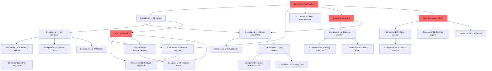

# CompTIA Network+ Platform - Component Dependencies & Order

## Overview

This document maps all dependencies between the 23 components and defines the optimal implementation order to minimize blockers and maximize parallel development opportunities.

---

## Dependency Graph

---

## Critical Path Components

### Tier 0: Foundation (Week 1-2)

**Must be completed before ANY component work:**

1. **Component Architecture**
   - Base component library
   - Props/state patterns
   - Styling system
   - Navigation structure
   - **Blocks**: ALL components
   - **Estimated Time**: 5-7 days
   - **Risk**: High (affects everything)

2. **Quiz/Assessment Framework**
   - Question bank structure
   - Answer validation
   - Scoring system
   - Progress tracking
   - **Blocks**: Components 2, 10, 22, 23
   - **Estimated Time**: 3-5 days
   - **Risk**: High

3. **Data Persistence Layer**
   - LocalStorage/IndexedDB setup
   - State management (Redux/Context)
   - Sync mechanism
   - **Blocks**: All components with progress tracking
   - **Estimated Time**: 2-3 days
   - **Risk**: Medium

---

### Tier 1: Core Framework Components (Week 2-3)

**Required by multiple downstream components:**

4. **Diagram/Visualization Framework**
   - SVG/Canvas rendering engine
   - Zoom/pan controls
   - Node/edge management
   - Export/import functionality
   - **Blocks**: Components 4, 5, 6, 15, 19, 20, 21
   - **Estimated Time**: 5-7 days
   - **Risk**: High

5. **Image/Media Library System**
   - Image optimization pipeline
   - Lazy loading system
   - Zoom/lightbox component
   - Asset management
   - **Blocks**: Components 4, 11, 12, 13, 14
   - **Estimated Time**: 3-4 days
   - **Risk**: Medium

6. **Calculator/Validation Engine**
   - Input validation
   - Real-time calculation
   - Error handling
   - Result formatting
   - **Blocks**: Components 16, 17, 18, 21
   - **Estimated Time**: 4-5 days
   - **Risk**: High

---

## Detailed Component Dependencies

### Phase 1: Foundation & OSI Model

#### Component 1: OSI Model Interactive
**Dependencies:**
- Component Architecture ✓
- Design System ✓
- Animation library (optional)

**Blocks:**
- Component 4 (builds on OSI knowledge)
- Component 9 (references OSI layers)

**Can Build in Parallel With:**
- Components 2, 3

**Estimated Time**: 3-4 days

---

#### Component 2: Protocol Matching Game
**Dependencies:**
- Component Architecture ✓
- Quiz Framework ✓
- Drag-and-drop library (React DnD, dnd-kit)

**Blocks:**
- Component 10 (similar game mechanics)

**Can Build in Parallel With:**
- Components 1, 3

**Estimated Time**: 4-5 days

---

#### Component 3: Data Encapsulation Visualization
**Dependencies:**
- Component Architecture ✓
- Animation library (Framer Motion, GSAP)

**Blocks:**
- None (leaf component)

**Can Build in Parallel With:**
- Components 1, 2

**Estimated Time**: 3-4 days

---

### Phase 2: Network Appliances & Cloud

#### Component 4: Network Appliances Identifier
**Dependencies:**
- Component Architecture ✓
- Component 1 (OSI references) ✓
- Diagram Framework ✓
- Image Library ✓

**Blocks:**
- Component 5 (virtualization builds on physical appliances)

**Can Build in Parallel With:**
- None initially; starts after Diagram Framework

**Estimated Time**: 4-5 days

---

#### Component 5: Virtualization Concepts
**Dependencies:**
- Component 4 (physical appliances context) ✓
- Diagram Framework ✓

**Blocks:**
- Component 6 (cloud virtualization)

**Can Build in Parallel With:**
- Components 9, 11

**Estimated Time**: 2-3 days

---

#### Component 6: Cloud Models Comparison
**Dependencies:**
- Component 5 (virtualization basics) ✓
- Comparison UI pattern

**Blocks:**
- Components 7, 8

**Can Build in Parallel With:**
- Components 9, 11

**Estimated Time**: 3-4 days

---

#### Component 7: Cloud Service Types
**Dependencies:**
- Component 6 (cloud models) ✓

**Blocks:**
- None (leaf component)

**Can Build in Parallel With:**
- Component 8

**Estimated Time**: 2-3 days

---

#### Component 8: Storage Technologies
**Dependencies:**
- Component 6 (cloud context) ✓
- Decision tree UI pattern

**Blocks:**
- None (leaf component)

**Can Build in Parallel With:**
- Component 7

**Estimated Time**: 3-4 days

---

### Phase 3: Protocols & Media

#### Component 9: Port Number Practice
**Dependencies:**
- Component Architecture ✓
- Quiz Framework ✓
- Spaced Repetition Algorithm
- Component 1 (OSI layer context) ✓

**Blocks:**
- Components 16, 17, 18 (IP addressing builds on ports)

**Can Build in Parallel With:**
- Components 5, 6, 11

**Estimated Time**: 4-5 days

---

#### Component 10: Protocol Purpose Quiz
**Dependencies:**
- Component 2 (matching game mechanics) ✓
- Quiz Framework ✓

**Blocks:**
- Component 21 (DNS uses similar quiz patterns)

**Can Build in Parallel With:**
- Components 11, 12

**Estimated Time**: 3-4 days

---

#### Component 11: Cable Types Selector
**Dependencies:**
- Component Architecture ✓
- Image Library ✓
- Decision wizard pattern

**Blocks:**
- Components 12, 14 (cable/connector relationship)

**Can Build in Parallel With:**
- Components 9, 10

**Estimated Time**: 3-4 days

---

#### Component 12: Fiber vs Copper Comparison
**Dependencies:**
- Component 11 (cable types context) ✓
- Comparison UI pattern

**Blocks:**
- None (leaf component)

**Can Build in Parallel With:**
- Components 13, 14

**Estimated Time**: 2-3 days

---

#### Component 13: Wireless Standards Timeline
**Dependencies:**
- Component 11 (wireless cable context) ✓
- Timeline UI component

**Blocks:**
- None (leaf component)

**Can Build in Parallel With:**
- Components 12, 14

**Estimated Time**: 3-4 days

---

#### Component 14: Media Connectors Library
**Dependencies:**
- Component 11 (cable types) ✓
- Image Library ✓

**Blocks:**
- None (leaf component)

**Can Build in Parallel With:**
- Components 12, 13

**Estimated Time**: 4-5 days (image collection intensive)

---

### Phase 4: Topologies & IPv4

#### Component 15: Network Topologies Simulator
**Dependencies:**
- Diagram Framework ✓
- Simulation engine
- Component 4 (network devices) ✓

**Blocks:**
- Components 19, 20 (routing/switching use topology concepts)

**Can Build in Parallel With:**
- Component 16 (different domain)

**Estimated Time**: 6-8 days (complex simulation)

---

#### Component 16: Subnetting Calculator
**Dependencies:**
- Calculator/Validation Engine ✓
- Component 9 (IP/port relationship context) ✓

**Blocks:**
- Components 17, 18, 21

**Can Build in Parallel With:**
- Component 15

**Estimated Time**: 5-7 days (complex calculations)

---

#### Component 17: IPv4 vs IPv6 Comparison
**Dependencies:**
- Component 16 (subnetting concepts) ✓
- Comparison UI pattern

**Blocks:**
- None (leaf component)

**Can Build in Parallel With:**
- Component 18

**Estimated Time**: 3-4 days

---

#### Component 18: IP Address Classes
**Dependencies:**
- Component 16 (IP addressing basics) ✓
- Quiz Framework ✓

**Blocks:**
- None (leaf component)

**Can Build in Parallel With:**
- Component 17

**Estimated Time**: 2-3 days

---

### Phase 5: Modern Networking

#### Component 19: Routing Protocols Flowchart
**Dependencies:**
- Component 15 (topology understanding) ✓
- Diagram Framework ✓
- Flowchart/decision tree pattern

**Blocks:**
- None (leaf component)

**Can Build in Parallel With:**
- Components 20, 21

**Estimated Time**: 4-5 days

---

#### Component 20: Switch Features Matrix
**Dependencies:**
- Component 15 (network topology context) ✓
- Matrix/table UI component

**Blocks:**
- None (leaf component)

**Can Build in Parallel With:**
- Components 19, 21

**Estimated Time**: 3-4 days

---

#### Component 21: DNS Lookup Simulator
**Dependencies:**
- Component 16 (IP addressing) ✓
- Calculator/Validation Engine ✓
- Component 10 (protocol quiz patterns) ✓
- Simulation/visualization engine

**Blocks:**
- None (leaf component)

**Can Build in Parallel With:**
- Components 19, 20

**Estimated Time**: 5-6 days

---

### Phase 6: Assessment & Integration

#### Component 22: Network Troubleshooting Scenarios
**Dependencies:**
- Quiz Framework ✓
- ALL previous components (references concepts from 1-21)
- Scenario engine
- Decision tree pattern

**Blocks:**
- Component 23 (exam includes troubleshooting)

**Can Build in Parallel With:**
- Nothing (requires most components complete)

**Estimated Time**: 6-8 days

---

#### Component 23: Practice Exam Mode
**Dependencies:**
- Quiz Framework ✓
- Component 22 (scenario questions) ✓
- ALL previous components (comprehensive exam)
- Timer/exam UI
- Score reporting system

**Blocks:**
- None (final component)

**Can Build in Parallel With:**
- Nothing (requires ALL components complete)

**Estimated Time**: 5-7 days

---

## Optimal Implementation Order

### Sequential Order (Respecting Dependencies)

**Week 1-2: Foundation**
1. Component Architecture (Tier 0)
2. Quiz Framework (Tier 0)
3. Data Persistence (Tier 0)

**Week 2-3: Core Frameworks**
4. Diagram Framework (Tier 1)
5. Image Library (Tier 1)
6. Calculator Engine (Tier 1)

**Week 3-4: Phase 1 Components**
7. Component 1: OSI Model (parallel)
8. Component 2: Protocol Matching (parallel)
9. Component 3: Data Encapsulation (parallel)

**Week 5-7: Phase 2 Components**
10. Component 4: Network Appliances
11. Component 5: Virtualization (parallel with 9)
12. Component 6: Cloud Models (parallel with 9, 11)
13. Component 9: Port Numbers (parallel with 5, 6, 11)
14. Component 11: Cable Selector (parallel with 5, 6, 9)
15. Component 7: Cloud Service Types (after 6)
16. Component 8: Storage Tech (parallel with 7)

**Week 8-10: Phase 3 Components**
17. Component 10: Protocol Quiz (parallel with 12, 13)
18. Component 12: Fiber vs Copper (parallel with 10, 13, 14)
19. Component 13: Wireless Timeline (parallel with 10, 12, 14)
20. Component 14: Media Connectors (parallel with 10, 12, 13)

**Week 11-14: Phase 4 Components**
21. Component 15: Topology Simulator (parallel with 16)
22. Component 16: Subnetting Calculator (parallel with 15)
23. Component 17: IPv4 vs IPv6 (after 16, parallel with 18)
24. Component 18: IP Classes (after 16, parallel with 17)

**Week 15-18: Phase 5 Components**
25. Component 19: Routing Flowchart (parallel with 20, 21)
26. Component 20: Switch Matrix (parallel with 19, 21)
27. Component 21: DNS Simulator (parallel with 19, 20)

**Week 19-21: Phase 6 Components**
28. Component 22: Troubleshooting Scenarios
29. Component 23: Practice Exam Mode (after 22)

---

## Parallel Development Opportunities

### Team of 3 Developers

**Week 3-4 (Phase 1):**
- Dev 1: Component 1 (OSI Model)
- Dev 2: Component 2 (Protocol Matching)
- Dev 3: Component 3 (Data Encapsulation)

**Week 5-6 (Phase 2 Start):**
- Dev 1: Component 4 (Network Appliances)
- Dev 2: Component 9 (Port Numbers)
- Dev 3: Component 11 (Cable Selector)

**Week 7-8 (Phase 2 Continue):**
- Dev 1: Component 5 (Virtualization) + Component 7 (Cloud Services)
- Dev 2: Component 6 (Cloud Models) + Component 8 (Storage)
- Dev 3: Component 10 (Protocol Quiz)

**Week 9-10 (Phase 3):**
- Dev 1: Component 12 (Fiber vs Copper)
- Dev 2: Component 13 (Wireless Timeline)
- Dev 3: Component 14 (Media Connectors)

**Week 11-13 (Phase 4):**
- Dev 1: Component 15 (Topology Simulator)
- Dev 2: Component 16 (Subnetting Calculator)
- Dev 3: Component 17 + 18 (IP Addressing)

**Week 14-16 (Phase 5):**
- Dev 1: Component 19 (Routing Flowchart)
- Dev 2: Component 20 (Switch Matrix)
- Dev 3: Component 21 (DNS Simulator)

**Week 17-19 (Phase 6):**
- All Devs: Component 22 (Troubleshooting - pair programming)
- All Devs: Component 23 (Practice Exam - pair programming)

---

## External Dependencies

### Third-Party Libraries

**Critical (Must Evaluate Early):**
- React DnD / dnd-kit (drag-and-drop)
- Framer Motion / GSAP (animations)
- D3.js / Cytoscape.js (network diagrams)
- React Router (navigation)
- Redux / Zustand (state management)

**Evaluation Deadline**: End of Week 1

---

### Data & Content Dependencies

**Critical (Must Acquire/Create Early):**
- OSI layer descriptions (Component 1)
- Protocol database (Components 2, 9, 10)
- Network appliance specifications (Component 4)
- Cable/connector images (Components 11, 14)
- Practice exam questions (Component 23)

**Acquisition Deadline**: End of Week 2

---

### Infrastructure Dependencies

**Must Be Ready Before Development:**
- Git repository
- CI/CD pipeline
- Development/staging environments
- Database (if using backend)
- CDN (for images)
- Analytics integration

**Setup Deadline**: End of Week 1

---

## Risk Management

### High-Risk Dependencies

**1. Diagram Framework (Tier 1)**
- **Risk**: Performance issues with complex diagrams
- **Mitigation**: Prototype early (Week 2), load test with 100+ nodes
- **Blocks**: 7 components (4, 5, 6, 15, 19, 20, 21)

**2. Subnetting Calculator (Component 16)**
- **Risk**: Complex calculation errors
- **Mitigation**: Extensive unit tests, third-party validation
- **Blocks**: 4 components (17, 18, 21, 22)

**3. Quiz Framework (Tier 0)**
- **Risk**: Inflexible design limits later components
- **Mitigation**: Design for extensibility from day 1
- **Blocks**: 5+ components (2, 10, 18, 22, 23)

### Dependency Bottlenecks

**Single Point of Failure:**
- Component Architecture (blocks ALL work)
- Diagram Framework (blocks 7 components)

**Mitigation:**
- Assign best developers to these tasks
- Prototype and validate early
- Build in extra buffer time (1.5x estimate)

---

## Change Impact Analysis

### If Component Architecture Delayed by 1 Week:
- **Impact**: ALL components delayed by 1 week
- **Cost**: Entire project delayed, 24-week timeline
- **Mitigation**: Parallelize where possible, cut P2/P3 features

### If Diagram Framework Delayed by 1 Week:
- **Impact**: Components 4, 5, 6, 15, 19, 20, 21 delayed
- **Cost**: Phases 2, 4, 5 delayed, 20-week timeline
- **Mitigation**: Work on Phase 3 components (9-14) during delay

### If Subnetting Calculator Delayed by 1 Week:
- **Impact**: Components 17, 18, 21 delayed
- **Cost**: Phase 4 completion delayed, 19-week timeline
- **Mitigation**: Start Phase 5 components early

---

## Integration Points

### Phase Integration Dependencies

**Phase 1 → Phase 2:**
- Component 1 must be stable (referenced by Component 4)
- Base architecture must support diagram rendering

**Phase 2 → Phase 3:**
- Image optimization pipeline must be proven
- Diagram framework must handle multiple use cases

**Phase 3 → Phase 4:**
- Port number knowledge feeds into IP addressing
- Quiz patterns established for IP classes

**Phase 4 → Phase 5:**
- Topology understanding required for routing
- IP addressing essential for DNS simulator

**Phase 5 → Phase 6:**
- All components must be feature-complete
- Integration testing reveals gaps

---

**Document Version**: 1.0
**Last Updated**: 2025-10-28
**Next Review**: Weekly during development
