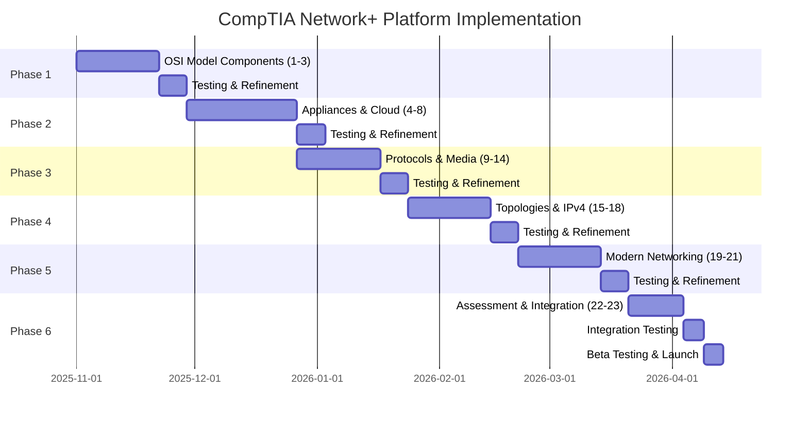

# CompTIA Network+ Learning Platform - Implementation Roadmap

## Overview

This roadmap outlines the phased implementation strategy for all 23 components of the CompTIA Network+ learning platform, organized into 6 major phases spanning approximately 18-24 weeks.

## Phase 1: Foundation & OSI Model (Weeks 1-4)

**Components:**
1. OSI Model Layers Interactive (Component 1)
2. Protocol Matching Game (Component 2)
3. Data Encapsulation Visualization (Component 3)

**Objectives:**
- Establish core educational framework
- Build reusable component architecture
- Implement base styling system
- Create component library foundation

**Key Deliverables:**
- Interactive OSI model with layer descriptions
- Drag-and-drop protocol matching interface
- Animated data encapsulation flow
- Unit test framework established
- Component documentation system

**Success Criteria:**
- All components render correctly
- Interactive features work smoothly
- 80%+ test coverage
- Responsive on mobile/desktop
- Accessibility WCAG AA compliant

---

## Phase 2: Network Appliances & Cloud (Weeks 5-9)

**Components:**
4. Network Appliances Identifier (Component 4)
5. Virtualization Concepts (Component 5)
6. Cloud Models Comparison (Component 6)
7. Cloud Service Types (Component 7)
8. Storage Technologies (Component 8)

**Objectives:**
- Implement infrastructure visualization
- Build comparison interfaces
- Create interactive diagrams
- Develop quiz components

**Key Deliverables:**
- Network appliance identification tool
- Virtual vs physical infrastructure diagrams
- IaaS/PaaS/SaaS comparison matrix
- Cloud deployment model explorer
- Storage technology decision tree

**Success Criteria:**
- Complex diagrams render efficiently
- Comparison tools are intuitive
- Quiz feedback is immediate
- Visual consistency across components
- Performance: <2s load time

---

## Phase 3: Protocols & Media (Weeks 10-13)

**Components:**
9. Port Number Practice (Component 9)
10. Protocol Purpose Quiz (Component 10)
11. Cable Types Selector (Component 11)
12. Fiber vs Copper Comparison (Component 12)
13. Wireless Standards Timeline (Component 13)
14. Media Connectors Library (Component 14)

**Key Deliverables:**
- Port number flashcard system
- Protocol purpose matching game
- Cable selection wizard
- Interactive comparison charts
- Historical wireless standards timeline
- Connector identification tool with images

**Success Criteria:**
- Flashcard system with spaced repetition
- Visual cable/connector library
- Performance optimized images
- Quiz scoring and progress tracking
- Bookmark/favorite functionality

---

## Phase 4: Topologies & IPv4 (Weeks 14-17)

**Components:**
15. Network Topologies Simulator (Component 15)
16. Subnetting Calculator (Component 16)
17. IPv4 vs IPv6 Comparison (Component 17)
18. IP Address Classes (Component 18)

**Objectives:**
- Build network simulation engine
- Implement complex calculators
- Create visual comparison tools
- Develop IP addressing tutorials

**Key Deliverables:**
- Interactive topology builder
- Real-time subnetting calculator with validation
- Side-by-side IPv4/IPv6 comparison
- IP class identification trainer
- CIDR notation converter

**Success Criteria:**
- Topology simulator handles 50+ nodes
- Subnet calculator is accurate and fast
- Visual feedback for IP calculations
- Tutorial mode for beginners
- Advanced mode for experts

---

## Phase 5: Modern Networking (Weeks 18-21)

**Components:**
19. Routing Protocols Flowchart (Component 19)
20. Switch Features Matrix (Component 20)
21. DNS Lookup Simulator (Component 21)

**Objectives:**
- Implement advanced networking concepts
- Build simulation environments
- Create decision-making tools
- Develop troubleshooting interfaces

**Key Deliverables:**
- Interactive routing protocol decision tree
- Switch capabilities comparison matrix
- Live DNS lookup simulator with visualization
- BGP/OSPF/EIGRP comparison tool
- VLAN and trunking simulator

**Success Criteria:**
- Flowcharts are navigable and clear
- Matrix supports filtering/sorting
- DNS simulator shows real-time queries
- Complex concepts simplified visually
- Performance: <1s interaction response

---

## Phase 6: Assessment & Integration (Weeks 22-24)

**Components:**
22. Network Troubleshooting Scenarios (Component 22)
23. Practice Exam Mode (Component 23)

**Objectives:**
- Integrate all previous components
- Build comprehensive assessment system
- Implement progress tracking
- Create certification prep tools

**Key Deliverables:**
- Scenario-based troubleshooting simulator
- Full-length practice exam interface
- Progress dashboard
- Performance analytics
- Study plan generator
- Certificate of completion

**Success Criteria:**
- All 23 components integrated seamlessly
- Practice exam mimics real certification
- Progress tracked across all modules
- Analytics provide actionable insights
- Platform ready for beta testing

---

## Gantt Chart (Text-Based)

```
Phase 1: Foundation & OSI Model
[████████░░░░░░░░░░░░░░] Weeks 1-4
  Component 1-3 Development    [████████]
  Testing & Refinement          [    ████]

Phase 2: Appliances & Cloud
[░░░░░░░░████████████░░░░░░] Weeks 5-9
  Component 4-8 Development    [    ████████]
  Testing & Refinement          [        ████]

Phase 3: Protocols & Media
[░░░░░░░░░░░░░░░░████████░░] Weeks 10-13
  Component 9-14 Development   [        ████████]
  Testing & Refinement          [            ████]

Phase 4: Topologies & IPv4
[░░░░░░░░░░░░░░░░░░░░████████] Weeks 14-17
  Component 15-18 Development  [            ████████]
  Testing & Refinement          [                ████]

Phase 5: Modern Networking
[░░░░░░░░░░░░░░░░░░░░░░░░████████] Weeks 18-21
  Component 19-21 Development  [                ████████]
  Testing & Refinement          [                    ████]

Phase 6: Assessment & Integration
[░░░░░░░░░░░░░░░░░░░░░░░░░░░░████] Weeks 22-24
  Component 22-23 Development  [                    ████]
  Integration Testing           [                      ██]
  Beta Testing & Launch Prep    [                      ██]
```

---

## Mermaid Gantt Chart



---

## Risk Mitigation

### Technical Risks
- **Complexity Creep**: Maintain strict component boundaries
- **Performance Issues**: Implement lazy loading and code splitting
- **Browser Compatibility**: Test on all major browsers weekly

### Schedule Risks
- **Scope Expansion**: Enforce feature freeze per phase
- **Resource Constraints**: Build buffer time into each phase
- **Integration Challenges**: Continuous integration from Phase 1

### Quality Risks
- **Test Coverage Gaps**: Automated test runs on every commit
- **Accessibility Issues**: Weekly accessibility audits
- **UX Inconsistencies**: Design system review at phase boundaries

---

## Dependencies Between Phases

1. **Phase 1 → Phase 2**: Component architecture must be stable
2. **Phase 2 → Phase 3**: Visual design system finalized
3. **Phase 3 → Phase 4**: Quiz/interaction patterns established
4. **Phase 4 → Phase 5**: Calculation engine proven reliable
5. **Phase 5 → Phase 6**: All individual components complete
6. **Phase 6**: Dependent on all previous phases

---

## Continuous Activities (All Phases)

- **Code Reviews**: Daily
- **Unit Testing**: Continuous
- **Integration Testing**: Weekly
- **Performance Monitoring**: Weekly
- **User Feedback Collection**: Bi-weekly
- **Documentation Updates**: Continuous
- **Accessibility Testing**: Weekly
- **Security Scanning**: Weekly

---

## Success Metrics

### Phase-Level Metrics
- On-time completion rate: >90%
- Test coverage: >80%
- Bug density: <5 bugs/component
- Performance: <3s page load

### Platform-Level Metrics
- User engagement: >20 min/session
- Component completion: >75%
- User satisfaction: >4.5/5
- Certification pass rate: >70%

---

## Post-Launch Roadmap (Phase 7+)

**Weeks 25-28: Stabilization**
- Bug fixes and optimization
- Performance tuning
- User feedback implementation

**Weeks 29-32: Enhancement**
- Advanced features
- Additional practice scenarios
- Mobile app development

**Weeks 33+: Expansion**
- CompTIA Security+ content
- CompTIA A+ integration
- Multi-language support
- Community features

---

## Approval & Sign-off

| Phase | Planned Completion | Actual Completion | Approved By | Date |
|-------|-------------------|-------------------|-------------|------|
| Phase 1 | Week 4 | | | |
| Phase 2 | Week 9 | | | |
| Phase 3 | Week 13 | | | |
| Phase 4 | Week 17 | | | |
| Phase 5 | Week 21 | | | |
| Phase 6 | Week 24 | | | |

---

**Document Version**: 1.0
**Last Updated**: 2025-10-28
**Next Review**: End of Phase 1
